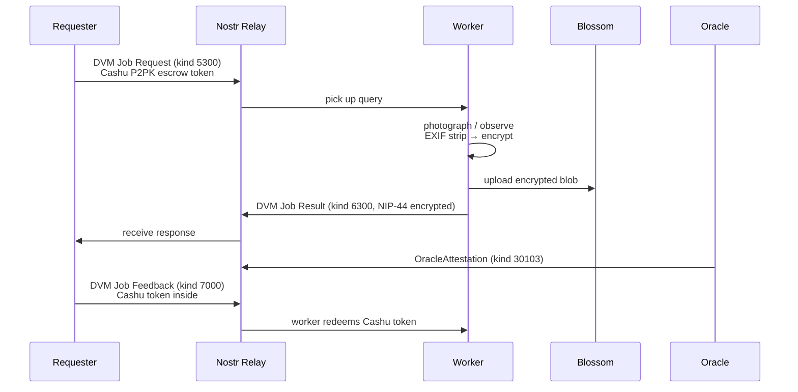
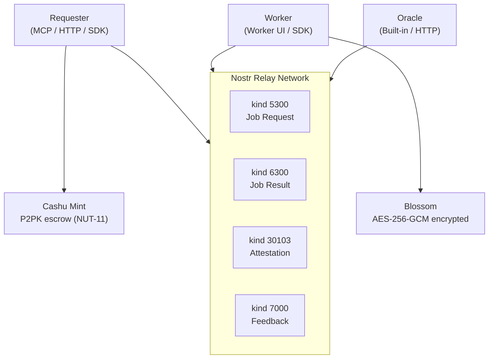
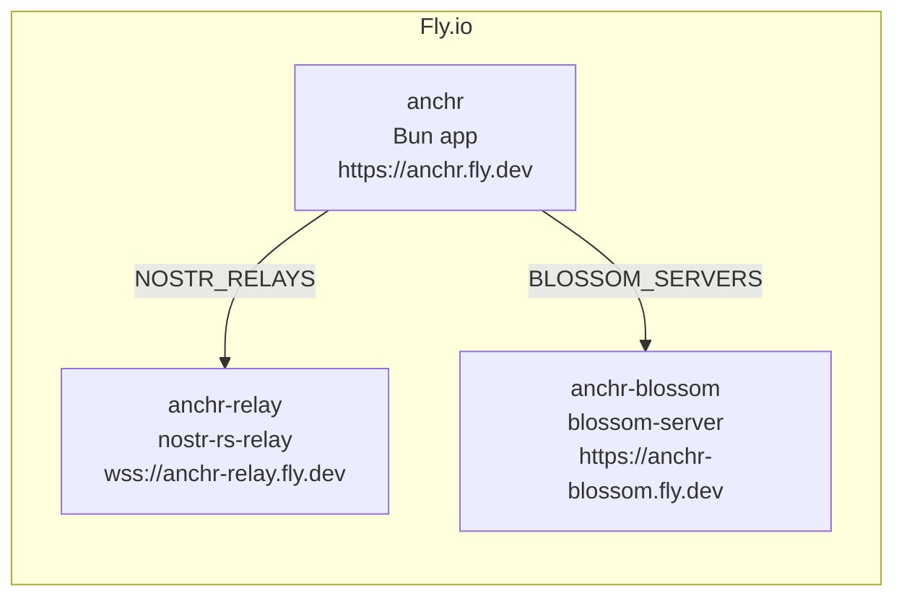
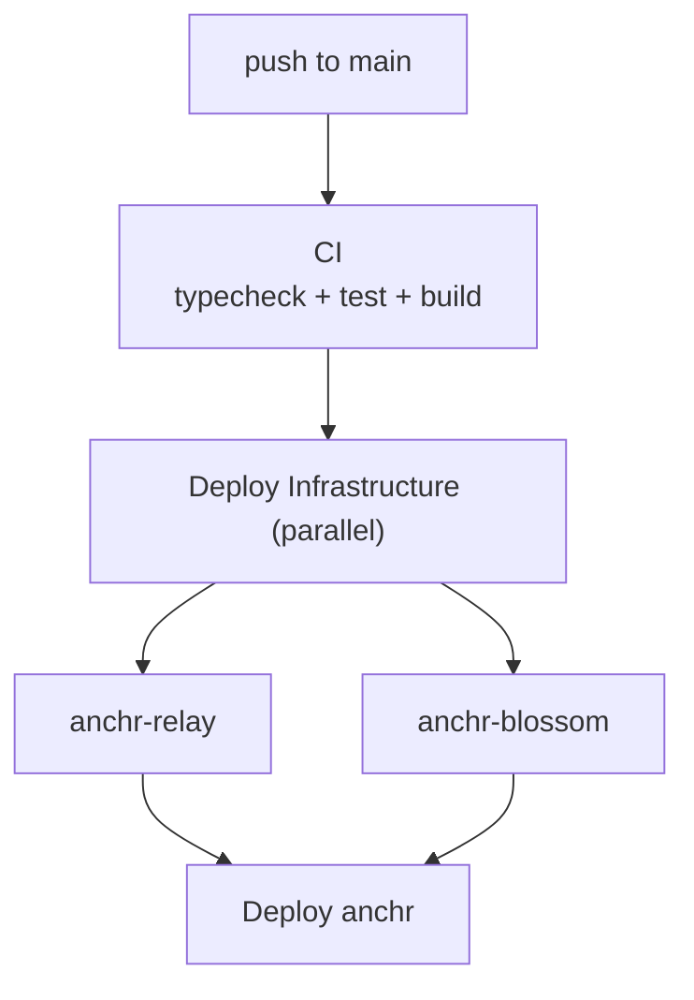

# Anchr

Anonymous real-world verification protocol on [Nostr](https://nostr.com/), paid with [Cashu](https://cashu.space/) ecash.

Requesters post queries (photo proof, store status, webpage field). Anonymous workers fulfill them on the ground. Deterministic oracles verify results; workers receive ecash on pass.

## How It Works



**Oracle selection is mutual**: the requester specifies acceptable oracles; the worker picks one. Verification is deterministic — anyone can reproduce the checks.

**Payment is anonymous**: Cashu ecash tokens are locked with P2PK (NUT-11) 2-of-2 multisig (Oracle + Worker). On pass, the oracle co-signs a swap. On failure, the token times out and the requester reclaims it.

## Architecture



Queries are stored in an in-memory Map and published to Nostr relays when `NOSTR_RELAYS` is set. The relay network is the durable persistence layer. For MCP proxy mode, set `REMOTE_QUERY_API_BASE_URL` to forward operations to a remote Anchr instance.

## Getting Started

### Prerequisites

- [Bun](https://bun.sh/) v1.3+
- [Docker](https://www.docker.com/) (for local relay & Blossom)

### Install & Demo

```bash
git clone https://github.com/motxx/anchr.git
cd anchr
bun install
bun run demo    # starts local relay + Blossom, runs full lifecycle
```

### Run

```bash
bun run start           # MCP + HTTP + worker UI
bun run dev             # with file watching

# with local infrastructure
bun run infra:up
NOSTR_RELAYS=ws://localhost:7777 BLOSSOM_SERVERS=http://localhost:3333 bun run start
```

### Test

```bash
bun run test            # unit + integration
bun run test:e2e        # E2E (starts docker compose)
bun run test:all        # all
```

## Usage

### MCP Tools (Claude Desktop)

```json
{
  "mcpServers": {
    "anchr": {
      "command": "bun",
      "args": ["run", "/path/to/anchr/src/index.ts"]
    }
  }
}
```

| Tool | Description |
|------|-------------|
| `request_photo_proof` | Request photo evidence of a real-world target |
| `request_store_status` | Check if a place is open or closed |
| `request_webpage_field` | Extract a specific field from a webpage |
| `get_query_status` | Poll query status and results |
| `submit_query_result` | Submit a result for a pending query |
| `cancel_query` | Cancel a pending query |
| `list_available_queries` | List queries waiting for reporters |
| `get_query_attachment` | Get attachment URL/metadata |
| `get_query_attachment_preview` | Get a resized preview image |

### HTTP API

Write endpoints require `Authorization: Bearer <key>` when `HTTP_API_KEY` is set.

<details>
<summary>Endpoints</summary>

| Method | Path | Description |
|--------|------|-------------|
| `GET` | `/health` | Health check |
| `GET` | `/oracles` | List available oracles |
| `GET` | `/queries` | List open queries |
| `GET` | `/queries/:id` | Query detail |
| `POST` | `/queries` | Create query |
| `POST` | `/queries/:id/upload` | Upload attachment |
| `POST` | `/queries/:id/submit` | Submit result |
| `POST` | `/queries/:id/cancel` | Cancel query |
| `GET` | `/queries/:id/attachments/:index` | Serve attachment |
| `GET` | `/queries/:id/attachments/:index/meta` | Attachment metadata |
| `GET` | `/queries/:id/attachments/:index/preview` | Resized preview |

</details>

### SDK

```ts
import { createQuery, submitQueryResult, queryTemplates } from "anchr";

const query = createQuery(
  queryTemplates.storeStatus("Ramen Jiro Shinjuku", "Tokyo"),
  { ttlSeconds: 300, oracleIds: ["built-in"] },
);

await submitQueryResult(query.id, {
  type: "store_status",
  status: "open",
}, { executor_type: "human", channel: "worker_api" }, "built-in");
```

## Configuration

| Variable | Default | Description |
|----------|---------|-------------|
| `REFERENCE_APP_PORT` | `3000` | HTTP server port |
| `NOSTR_RELAYS` | -- | Comma-separated relay WebSocket URLs |
| `BLOSSOM_SERVERS` | -- | Comma-separated Blossom server URLs |
| `HTTP_API_KEY` | -- | API key for write endpoints |
| `AI_CONTENT_CHECK` | `false` | Enable AI content check |
| `ANTHROPIC_API_KEY` | -- | Required when AI check is enabled |
| `REMOTE_QUERY_API_BASE_URL` | -- | Remote backend for MCP proxy mode |
| `REMOTE_QUERY_API_KEY` | -- | API key for remote backend |
| `CASHU_MINT_URL` | -- | Cashu mint URL for ecash payments |
| `ORACLE_PORT` | `4000` | Standalone oracle server port |
| `ORACLE_API_KEY` | -- | Oracle server authentication |
| `ORACLE_FEE_PPM` | -- | Oracle fee in parts-per-million |

## Deployment

Three Fly.io apps are deployed via CI/CD:





### Initial Setup

```bash
fly apps create anchr-relay
fly volumes create relay_data --app anchr-relay --region nrt --size 1

fly apps create anchr-blossom
fly volumes create blossom_data --app anchr-blossom --region nrt --size 1

fly launch --no-deploy --copy-config
fly volumes create data --size 1 --region nrt
fly secrets set HTTP_API_KEY=...
```

Set `FLY_API_TOKEN` as a GitHub Actions secret. Pushes to main auto-deploy all three apps.

## License

[MIT](LICENSE)
