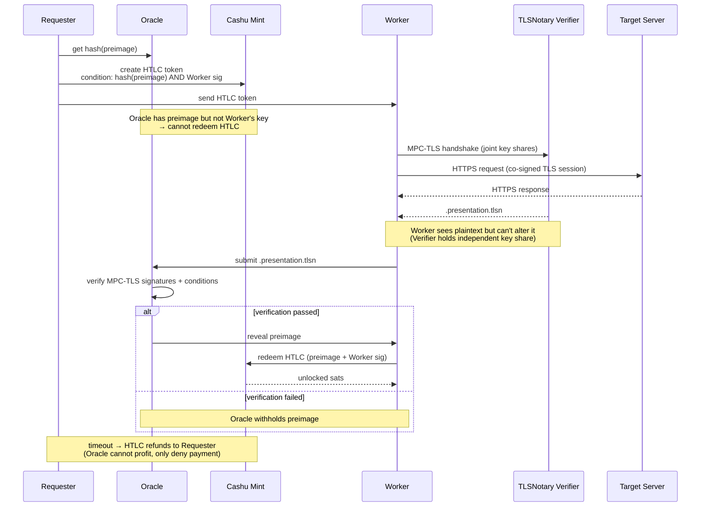
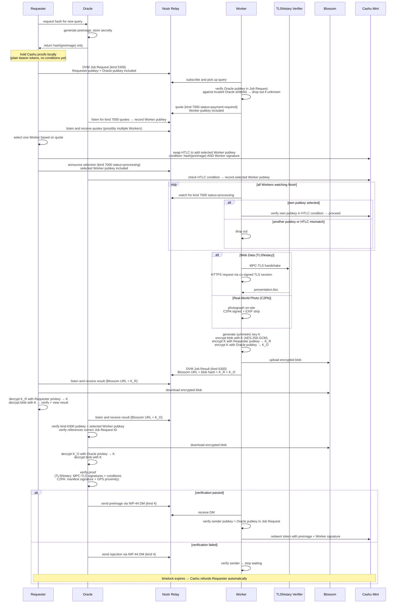

# Anchr

[](https://github.com/motxx/anchr/actions/workflows/ci.yml)

Decentralized marketplace for cryptographically verified data, paid with Bitcoin.

AI agents and humans buy verified API responses, price feeds, and real-world photos — with minimized trust. Workers earn sats by proving what servers returned (TLSNotary) or what they saw (C2PA).

## SDK

```typescript
import { Anchr } from "anchr-sdk";

const anchr = new Anchr({ serverUrl: "https://anchr-app.fly.dev" });

const result = await anchr.query({
  description: "BTC price from CoinGecko",
  targetUrl: "https://api.coingecko.com/api/v3/simple/price?ids=bitcoin&vs_currencies=usd",
  conditions: [{ type: "jsonpath", expression: "bitcoin.usd" }],
  maxSats: 21,
});

result.verified;    // true — cryptographically proven
result.data;        // { bitcoin: { usd: 71000 } }
result.serverName;  // "api.coingecko.com" — from TLS certificate
result.proof;       // TLSNotary presentation (independently verifiable)
```

## How It Works

This protocol is **trust-minimized**, not trustless. Cryptography eliminates several attack vectors, but residual trust assumptions remain.

**Protocol-level guarantees (Cashu [NUT-11](https://github.com/cashubtc/nuts/blob/main/11.md) P2PK + [NUT-14](https://github.com/cashubtc/nuts/blob/main/14.md) HTLC + [NUT-07](https://github.com/cashubtc/nuts/blob/main/07.md) State Check):**
- **Oracle cannot steal BTC** — HTLC redemption requires Worker's signature (NUT-11 P2PK), which Oracle cannot forge
- **Worker cannot forge proofs** — TLSNotary Verifier holds an independent MPC-TLS key share; Worker cannot alter the server's response
- **Worker cannot redeem without valid proof** — Oracle holds the preimage; HTLC hashlock (NUT-14) prevents redemption without it
- **Requester cannot revoke payment** — sats are locked in HTLC before work begins; Worker verifies proofs are UNSPENT on Mint (NUT-07) before starting work
- **Timeout refund is automatic** — NUT-11 locktime + refund pubkey returns sats to Requester if HTLC expires

**Residual trust assumptions:**
- **Cashu Mint** — trusted to honor token issuance, redemption, and NUT-14 HTLC spending condition enforcement (verified by E2E tests against Nutshell 0.19.2 — see `e2e/regtest-htlc-trustless.test.ts`). Anchr also verifies HTLC conditions server-side as defense in depth.
- **Oracle + Requester collusion** — Requester decrypts the result (via K_R) before Oracle verifies. If Oracle withholds the preimage, Requester gets data for free and BTC refunds on timeout. Oracle cannot profit, but Worker loses.
- **TLSNotary Verifier** — if Verifier colludes with Worker, they can combine key shares to forge proofs

**Mitigation — Oracle whitelist:** Requester specifies acceptable Oracles in the Job Request; Worker independently verifies the Oracle pubkey against its own trusted whitelist before accepting work. Both parties must agree on the Oracle, so a colluding Oracle would need to compromise the trust of both sides.

### Trustless Flow



<details>
<summary>Protocol Sequence (detailed)</summary>



### State Machine

```
awaiting_quotes → processing → verifying → approved  (preimage revealed, sats released)
                                         → rejected  (proofs refunded to Requester)
```

### Key Properties

- **Atomic payment**: Cashu HTLC locks funds — Worker can only redeem with the preimage, which Oracle only reveals on successful verification
- **Timeout refund**: If HTLC locktime expires, Requester reclaims the escrowed sats
- **Privacy**: Cashu blind signatures prevent Mint from linking token issuance to redemption; Nostr provides pseudonymous identity
- **Two proof types**: TLSNotary (web API data) and C2PA (real-world photos) — both cryptographically bound to source
- **Trust boundary**: Oracle honesty and Verifier independence are assumed — see [trust model](#how-it-works) above

</details>

## Two Verification Modes

### Web Data (TLSNotary)

Prove what any HTTPS server returned. Workers fetch the URL through a Multi-Party Computation TLS session — the Verifier Server co-signs the session without seeing the plaintext.

### Real-World Photos (C2PA)

Prove what a location looks like right now. Workers photograph with a C2PA-signed camera — the Content Credentials are cryptographically bound to the image, GPS, and timestamp.

## Use Cases

| Use case | Verification | Example |
|----------|-------------|---------|
| Price oracle (DeFi) | TLSNotary | Prove BTC/ETH price from CoinGecko, Binance |
| Flight status | TLSNotary | Prove flight delay for parametric insurance |
| API response proof | TLSNotary | Prove any HTTPS API returned specific data |
| Location check | C2PA + GPS | Photograph a store, intersection, event |
| Combined proof | Both | Photo of a price tag + API price verification |

## Quick Start

```bash
bun install
bun run infra:up                    # relay + blossom + verifier (docker)
bun run dev                         # server on :3000
```

Worker app (iOS / Android / Web):
```bash
cd mobile && bun install
bun run ios                         # or: bun run web
```

## API

```bash
# Web data query (TLSNotary)
curl -X POST localhost:3000/queries \
  -H "Content-Type: application/json" \
  -d '{
    "description": "BTC price from CoinGecko",
    "verification_requirements": ["tlsn"],
    "tlsn_requirements": {
      "target_url": "https://api.coingecko.com/api/v3/simple/price?ids=bitcoin&vs_currencies=usd",
      "conditions": [{"type": "jsonpath", "expression": "bitcoin.usd"}]
    },
    "bounty": {"amount_sats": 21}
  }'

# Photo query (C2PA)
curl -X POST localhost:3000/queries \
  -H "Content-Type: application/json" \
  -d '{
    "description": "渋谷スクランブル交差点の混雑状況",
    "expected_gps": {"lat": 35.6595, "lon": 139.7004},
    "max_gps_distance_km": 0.5,
    "bounty": {"amount_sats": 100}
  }'
```

<details>
<summary>Full endpoint list</summary>

| Method | Path | Description |
|--------|------|-------------|
| `POST` | `/hash` | Oracle generates preimage/hash pair |
| `POST` | `/queries` | Create query (HTLC mode) |
| `GET` | `/queries` | List open queries (`?lat=&lon=&max_distance_km=`) |
| `GET` | `/queries/all` | List all queries (any status) |
| `GET` | `/queries/:id` | Query detail |
| `POST` | `/queries/:id/quotes` | Worker submits quote |
| `POST` | `/queries/:id/select` | Select worker + verify HTLC token |
| `POST` | `/queries/:id/result` | Submit proof (inline verification → preimage) |
| `POST` | `/queries/:id/upload` | Upload photo (multipart) |
| `POST` | `/queries/:id/cancel` | Cancel query (refund proofs) |
| `GET` | `/queries/:id/attachments` | List attachments |
| `GET` | `/wallet/balance` | Wallet balance (`?role=&pubkey=&verify=true`) |
| `GET` | `/health` | Health check |
| `GET` | `/oracles` | List oracles |
| `GET` | `/logs/stream` | Server log stream (SSE) |

</details>

## MCP (AI Agent Integration)

Anchr exposes an MCP server so AI agents (Claude Desktop, Claude Code, etc.) can request cryptographically verified data.

### Claude Desktop

Add to `claude_desktop_config.json`:

```json
{
  "mcpServers": {
    "anchr": {
      "command": "bun",
      "args": ["run", "/path/to/anchr/src/mcp.ts"],
      "env": {
        "REMOTE_QUERY_API_BASE_URL": "https://anchr-app.fly.dev"
      }
    }
  }
}
```

### Claude Code

```bash
claude mcp add anchr -- bun run /path/to/anchr/src/mcp.ts
```

### Available tools

| Tool | Description |
|------|-------------|
| `create_query` | Request verified web data (TLSNotary) or real-world photos (C2PA) |
| `get_query_status` | Poll query status and retrieve verified results |
| `list_available_queries` | List open queries |
| `cancel_query` | Cancel a pending query |
| `get_query_attachment` | Get attachment URL/metadata |
| `get_query_attachment_preview` | Get resized preview image |

### Example: AI agent verifies BTC price

```
Human: "What is the current BTC price? I need a cryptographic proof."

Claude uses create_query:
  verification_requirements: ["tlsn"]
  target_url: "https://api.coingecko.com/api/v3/simple/price?ids=bitcoin&vs_currencies=usd"
  conditions: [{ type: "jsonpath", expression: "bitcoin.usd" }]

→ Auto-worker fetches via MPC-TLS, generates cryptographic proof
→ Claude polls get_query_status, receives verified data
→ "BTC is $XX,XXX (cryptographically proven via TLSNotary — server: api.coingecko.com)"
```

## Architecture

```
┌──────────────────────────────────────────────────────────────────┐
│                        Requester                                 │
│  anchr.query({ targetUrl, conditions, sats })                    │
└────────────┬─────────────────────────────────┬───────────────────┘
             │ Nostr kind 5300                  │ Cashu Proof[]
             ▼                                  ▼
┌────────────────────┐                ┌─────────────────┐
│    Nostr Relay      │                │   Cashu Mint     │
│  (broadcast + DM)   │                │ (Lightning-backed)│
└────────────┬────────┘                └──────┬──────────┘
             │ kind 5300                       │ checkProofsStates
             ▼                                 │
┌──────────────────────────────────────────────┼───────────────────┐
│                        Worker                │                    │
│                                              │                    │
│  TLSNotary path:          Photo path:        │                    │
│    tlsn-prove               C2PA camera      │                    │
│      ↕ MPC-TLS                ↓              │                    │
│    Verifier Server          Upload + GPS     │                    │
│      ↓                        ↓              │                    │
│    .presentation.tlsn       C2PA manifest    │                    │
│              ↓                 ↓             │                    │
│              └── Blossom (E2E encrypted) ────┘                    │
└────────────┬─────────────────────────────────────────────────────┘
             │ POST /queries/:id/result
             ▼
┌──────────────────────────────────────────────────────────────────┐
│                     Oracle (Anchr Server)                         │
│                                                                   │
│  TLSNotary: tlsn-verifier → MPC-TLS signature verify             │
│  C2PA: c2patool → Content Credentials signature verify            │
│  Conditions: jsonpath / regex / GPS haversine / nonce challenge   │
│                                                                   │
│  ✓ Pass → reveal preimage → Cashu HTLC bounty → Worker           │
│  ✗ Fail → refund Proof[] → Requester                             │
└──────────────────────────────────────────────────────────────────┘
```

## Configuration

| Variable | Description |
|----------|-------------|
| `NOSTR_RELAYS` | Relay WebSocket URLs (comma-separated) |
| `BLOSSOM_SERVERS` | Blossom blob server URLs |
| `CASHU_MINT_URL` | Cashu mint for ecash payments |
| `HTTP_API_KEY` | API key for write endpoints |
| `TLSN_VERIFIER_URL` | TLSNotary Verifier Server URL |
| `TLSN_PROXY_URL` | TLSNotary WebSocket proxy URL |

## Testing

```bash
bun test                         # all tests
bun test src/                    # unit tests
bun test e2e/tlsn.test.ts       # TLSNotary E2E (real MPC-TLS)
bun test e2e/tlsn-browser.test.ts  # browser extension E2E
bun run test:regtest             # Lightning + Cashu E2E
```

## Stack

| Layer | Tech |
|-------|------|
| SDK | TypeScript (`anchr-sdk`) |
| Server | Bun + Hono |
| Messaging | Nostr (NIP-90 DVM) |
| Storage | Blossom (E2E encrypted) |
| Payment | Cashu ecash (NUT-14 HTLC) / Lightning |
| Web Verification | TLSNotary (MPC-TLS + Rust verifier) |
| Photo Verification | C2PA + EXIF + ProofMode + GPS |
| TLS Verifier Server | Rust (async-tungstenite + WsStream) |
| Mobile | React Native (Expo) + NativeWind |

## License

[MIT](LICENSE)
