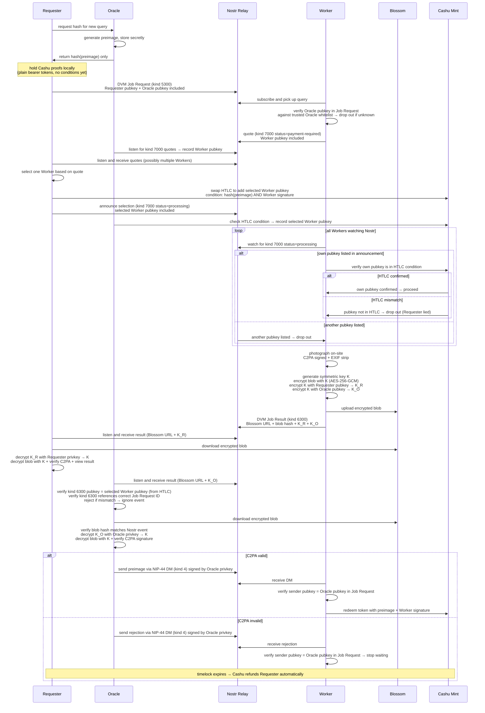
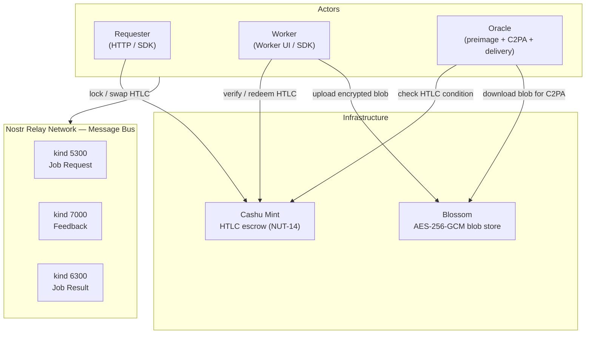
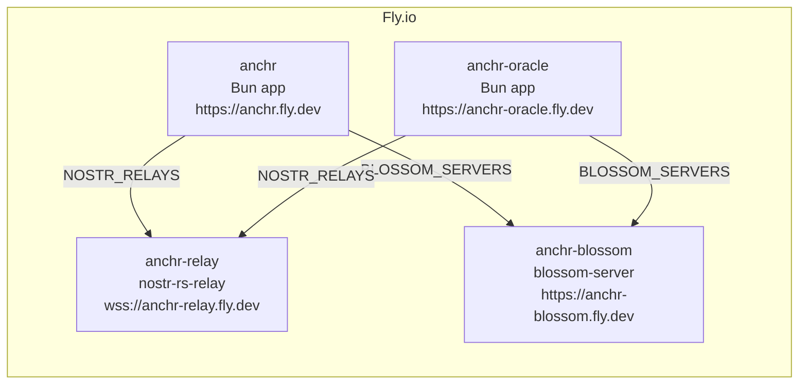
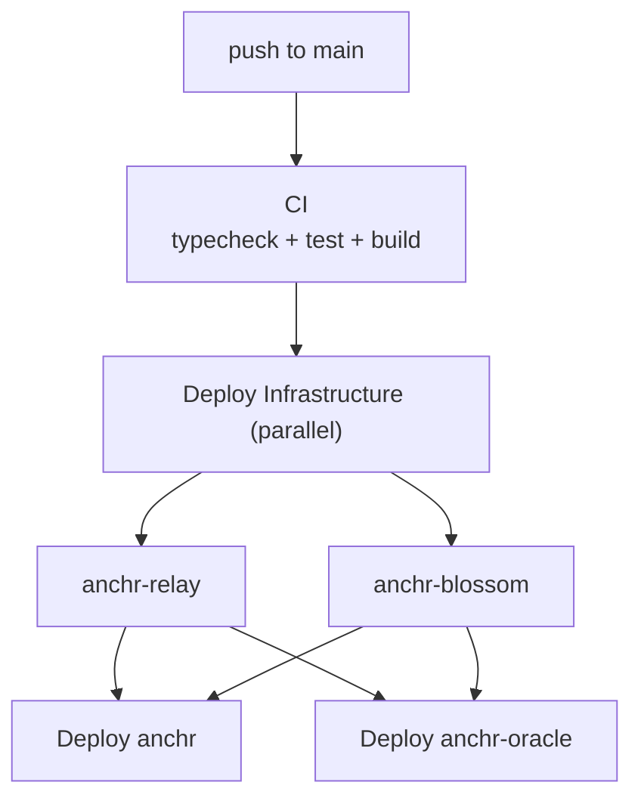

# Anchr

Anonymous real-world information protocol on [Nostr](https://nostr.com/), paid with [Cashu](https://cashu.space/) ecash.

Requesters post queries (photo proof, store status). Anonymous workers fulfill them on the ground. A minimal oracle verifies C2PA authenticity; workers receive ecash automatically on pass via HTLC.

## Design Principles

- **Pull-based**: Requesters specify what they want. Workers respond.
- **Anonymous**: No accounts, no identities. Nostr keypairs only.
- **Trustless payment**: Cashu HTLC escrow — funds release automatically on C2PA verification, refund on timeout.
- **Minimal oracle**: Oracle generates HTLC preimage at query creation, verifies C2PA authenticity, and delivers preimage to Worker on pass. No content judgment.

> Future: Oracle can be replaced entirely by Cairo Spending Conditions (ZK-based) once the ecosystem matures.

## How It Works



**Oracle cannot steal funds**: the HTLC requires both `hash(preimage)` AND the Worker's signature (NUT-14 `pubkeys` tag). Oracle alone cannot redeem — it knows the preimage but not the Worker's private key.

**Payment is trustless**: The Requester holds plain Cashu proofs locally until a Worker is selected. On selection, plain proofs are swapped for a Cashu HTLC token (NUT-14) locked to `hash(preimage) AND Worker pubkey`. Plain proofs are used in Phase 1 because the Requester does not know the preimage — the Mint requires it to spend hashlock-ed proofs. Oracle delivers the preimage to Worker via NIP-44 DM (kind 4) on C2PA pass. Timeout refunds the requester automatically via the `refund` tag (NUT-11).


## Architecture



## Payment Flow

| Step | Actor | Action |
|------|-------|--------|
| 1 | Requester | Ask Oracle for hash (Oracle generates preimage secretly, returns hash only) |
| 2 | Requester | Hold plain Cashu proofs locally (bearer tokens, no HTLC conditions yet) |
| 3 | Requester | Post DVM Job Request (kind 5300) with Oracle pubkey |
| 4 | Worker | Pick up query, verify Oracle pubkey against whitelist |
| 5 | Worker | Send quote (kind 7000 status=payment-required) with Worker pubkey |
| 6 | Requester | Select Worker, swap HTLC to add Worker pubkey |
| 7 | Requester | Announce selection (kind 7000 status=processing) |
| 8 | Oracle | Confirm selected Worker pubkey via HTLC |
| 9 | Worker | Confirm own pubkey in HTLC, photograph, encrypt with KEM+DEM, upload to Blossom |
| 10 | Worker | Post DVM Job Result (kind 6300) with Blossom URL + blob hash + K_R + K_O |
| 11 | Oracle | Verify Worker identity, download blob, verify blob hash, verify C2PA |
| 12 | Oracle | Send preimage via NIP-44 DM (kind 4) signed by Oracle privkey |
| 13 | Worker | Verify Oracle pubkey in DM, redeem HTLC with preimage + Worker signature |
| 14 (fallback) | Requester | Reclaim token automatically after timelock if no valid submission |

**Why Oracle cannot steal**: Oracle knows the preimage but not the Worker's private key. Both are required to redeem — neither party can act alone.

## Getting Started

### Prerequisites

- [Bun](https://bun.sh/) v1.3+
- [Docker](https://www.docker.com/) (for local relay & Blossom)

### Install & Demo

```bash
git clone https://github.com/motxx/anchr.git
cd anchr
bun install
bun run demo    # starts local relay + Blossom, runs full lifecycle
```

### Run

```bash
bun run start           # HTTP + worker UI
bun run dev             # with file watching

# with local infrastructure
bun run infra:up
NOSTR_RELAYS=ws://localhost:7777 BLOSSOM_SERVERS=http://localhost:3333 bun run start
```

### Test

```bash
bun run test            # unit + integration
bun run test:e2e        # E2E (starts docker compose)
bun run test:all        # all
```

## Usage

### HTTP API

Write endpoints require `Authorization: Bearer <key>` when `HTTP_API_KEY` is set.

<details>
<summary>Endpoints</summary>

| Method | Path | Description |
|--------|------|-------------|
| `GET` | `/health` | Health check |
| `GET` | `/oracles` | List registered oracles |
| `GET` | `/queries` | List open queries |
| `GET` | `/queries/:id` | Query detail |
| `POST` | `/queries` | Create query |
| `POST` | `/queries/:id/upload` | Upload attachment |
| `POST` | `/queries/:id/submit` | Submit result |
| `POST` | `/queries/:id/cancel` | Cancel query |
| `GET` | `/queries/:id/attachments` | List attachments |
| `GET` | `/queries/:id/attachments/:index` | Serve attachment |
| `GET` | `/queries/:id/attachments/:index/meta` | Attachment metadata |
| `GET` | `/queries/:id/attachments/:index/preview` | Resized preview |
| `GET` | `/queries/:id/quotes` | List worker quotes (HTLC) |
| `POST` | `/queries/:id/quotes` | Submit worker quote (HTLC) |
| `POST` | `/queries/:id/select` | Select worker (HTLC) |
| `POST` | `/queries/:id/result` | Submit worker result (HTLC) |

</details>

### SDK

```ts
import { createQuery, queryTemplates } from "anchr";

// Requester: create a query (fetches HTLC hash from Oracle internally)
const query = await createQuery(
  queryTemplates.photoProof("Shibuya crossing, Tokyo"),
  {
    ttlSeconds: 3600,
    oraclePubkey: "npub1...",   // trusted Oracle pubkey
    cashuMintUrl: "https://mint.example.com",
  },
);

// query.htlcToken  — locked Cashu HTLC token
// query.nostrEventId — kind 5300 Job Request ID
```

## Configuration

| Variable | Default | Description |
|----------|---------|-------------|
| `REFERENCE_APP_PORT` | `3000` | HTTP server port |
| `NOSTR_RELAYS` | -- | Comma-separated relay WebSocket URLs |
| `BLOSSOM_SERVERS` | -- | Comma-separated Blossom server URLs |
| `HTTP_API_KEY` | -- | API key for write endpoints |
| `CASHU_MINT_URL` | -- | Cashu mint URL for ecash payments |
| `ORACLE_PORT` | `4000` | Oracle server port |
| `ORACLE_API_KEY` | -- | Oracle server authentication |
| `TRUSTED_ORACLE_PUBKEYS` | -- | Comma-separated pubkeys of trusted Oracles (Worker whitelist) |

## Deployment

Four Fly.io apps are deployed via CI/CD:





### Initial Setup

```bash
fly apps create anchr-relay
fly volumes create relay_data --app anchr-relay --region nrt --size 1

fly apps create anchr-blossom
fly volumes create blossom_data --app anchr-blossom --region nrt --size 1

fly launch --no-deploy --copy-config
fly volumes create data --size 1 --region nrt
fly secrets set HTTP_API_KEY=...
```

Set `FLY_API_TOKEN` as a GitHub Actions secret. Pushes to main auto-deploy all four apps.

## Roadmap

- [ ] Oracle fee: two-HTLC design for trustless Worker+Oracle fee distribution (currently Oracle runs free)
- [ ] Oracle discovery: NIP-89 (kind 31990) registration for decentralized Oracle registry — replaces hardcoded whitelist, enables multiple competing Oracles and graceful failover
- [ ] Oracle → Cairo Spending Conditions (trustless C2PA verification via ZK)
- [ ] Worker reputation layer
- [ ] AI-assisted query decomposition (for non-Diaspora requesters)

## License

[MIT](LICENSE)