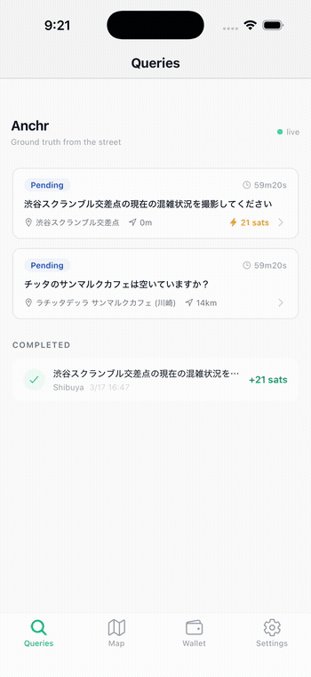
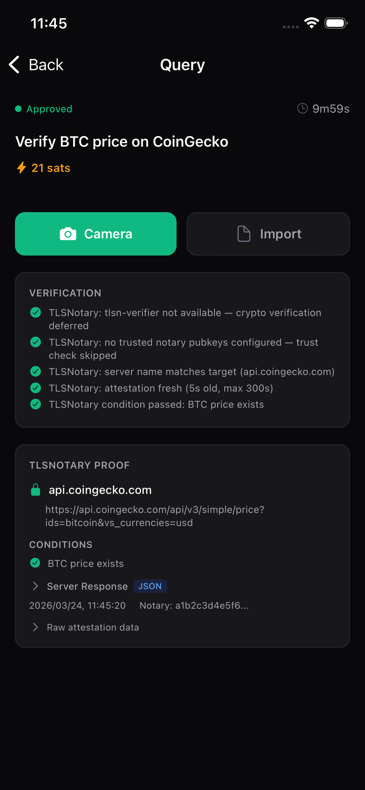

# Anchr

Anonymous real-world verification on [Nostr](https://nostr.com/), paid with [Cashu](https://cashu.space/) ecash.

Post a query. A nearby worker photographs it — or proves web content via TLSNotary. Verified cryptographically. Ecash released automatically.

<p align="center">
  
</p>

## Quick Start

```bash
bun install
bun run infra:up                    # relay + blossom (docker)
NOSTR_RELAYS=ws://localhost:7777 \
BLOSSOM_SERVERS=http://localhost:3333 \
bun run dev                         # server on :3000
```

Worker app (iOS / Android / Web):
```bash
cd mobile && bun install
bun run ios                         # or: bun run web
```

## How It Works

### Photo Verification (C2PA)

1. **Requester** creates a query with GPS + bounty (Cashu ecash)
2. Query broadcasts via **Nostr** relay to nearby workers
3. **Worker** photographs the location (C2PA-signed camera)
4. **Oracle** verifies C2PA signature + GPS proximity
5. Verification passes → bounty released to worker automatically

### Web Content Verification (TLSNotary)

1. **Requester** creates a query with target URL + conditions
2. **Worker** fetches the URL through a TLSNotary session
3. **Oracle** verifies attestation signature, domain, freshness, and content conditions
4. Verification passes → bounty released, proof viewable on-chain

<p align="center">
  
  
</p>

Payment is trustless: Cashu HTLC escrow (NUT-14) — preimage held by Oracle, redeemed by Worker on pass, refunded to Requester on timeout.

## API

```bash
# Create photo query
curl -X POST localhost:3000/queries \
  -H "Content-Type: application/json" \
  -d '{
    "description": "渋谷スクランブル交差点の混雑状況",
    "expected_gps": {"lat": 35.6595, "lon": 139.7004},
    "max_gps_distance_km": 0.5,
    "bounty": {"amount_sats": 21}
  }'

# Create TLSNotary query
curl -X POST localhost:3000/queries \
  -H "Content-Type: application/json" \
  -d '{
    "description": "Verify BTC price on CoinGecko",
    "verification_requirements": ["tlsn"],
    "tlsn_requirements": {
      "target_url": "https://api.coingecko.com/api/v3/simple/price?ids=bitcoin&vs_currencies=usd",
      "conditions": [{"type": "jsonpath", "expression": "bitcoin.usd", "description": "BTC price exists"}]
    },
    "bounty": {"amount_sats": 21}
  }'

# List queries (with distance filter)
curl "localhost:3000/queries?lat=35.66&lon=139.70"

# Submit photo result
curl -X POST localhost:3000/queries/{id}/submit \
  -H "Content-Type: application/json" \
  -d '{"gps": {"lat": 35.6595, "lon": 139.7004}, "notes": "混雑してます"}'
```

<details>
<summary>Full endpoint list</summary>

| Method | Path | Description |
|--------|------|-------------|
| `GET` | `/queries` | List open queries (`?lat=&lon=&max_distance_km=`) |
| `GET` | `/queries/:id` | Query detail |
| `POST` | `/queries` | Create query |
| `POST` | `/queries/:id/upload` | Upload photo (multipart) |
| `POST` | `/queries/:id/submit` | Submit result |
| `POST` | `/queries/:id/cancel` | Cancel query |
| `GET` | `/queries/:id/attachments` | List attachments |
| `POST` | `/queries/:id/quotes` | Worker quote (HTLC flow) |
| `POST` | `/queries/:id/select` | Select worker (HTLC flow) |
| `GET` | `/health` | Health check |
| `GET` | `/oracles` | List oracles |

</details>

## Configuration

| Variable | Description |
|----------|-------------|
| `NOSTR_RELAYS` | Relay WebSocket URLs (comma-separated) |
| `BLOSSOM_SERVERS` | Blossom blob server URLs |
| `CASHU_MINT_URL` | Cashu mint for ecash payments |
| `HTTP_API_KEY` | API key for write endpoints |
| `TRUSTED_NOTARY_PUBKEYS` | TLSNotary trusted notary pubkeys (comma-separated hex) |
| `DEFAULT_NOTARY_URL` | Default TLSNotary notary URL |

## Testing

```bash
bun run test:unit       # unit tests (no Docker)
bun run test            # full suite (starts Docker)
bun run test:regtest    # regtest Lightning + Cashu E2E
```

## Deploy

CI/CD via GitHub Actions → [fly.io](https://fly.io):

```
anchr-app.fly.dev       — server + worker UI
anchr-relay.fly.dev     — Nostr relay
anchr-blossom.fly.dev   — Blossom blob store
```

Push to `main` auto-deploys all services.

## Stack

| Layer | Tech |
|-------|------|
| Server | Bun + Hono |
| Messaging | Nostr (NIP-90 DVM) |
| Storage | Blossom (E2E encrypted) |
| Payment | Cashu ecash (NUT-14 HTLC) |
| Verification | C2PA + EXIF + ProofMode + GPS + TLSNotary |
| Mobile | React Native (Expo) + NativeWind |
| Web | Same codebase via Expo Web |

## License

[MIT](LICENSE)
