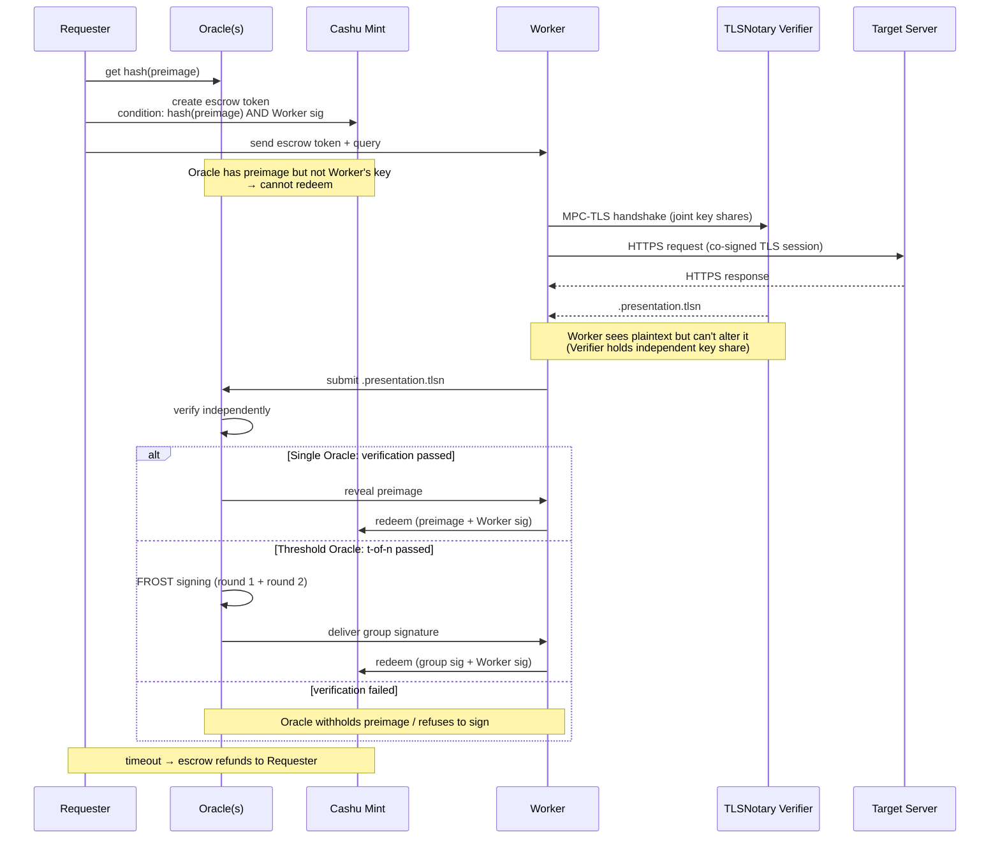
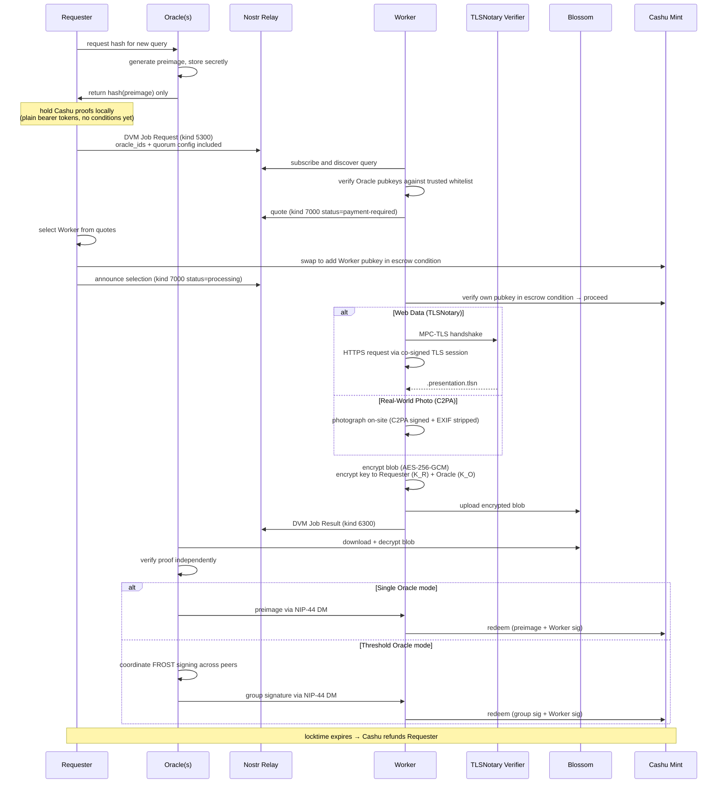

# Anchr Protocol

[](https://github.com/motxx/anchr/actions/workflows/ci.yml)

Atomic swap of verifiable data and Bitcoin — without a trusted third party.

Anchr is a protocol that atomically exchanges cryptographic proofs for payment. Data is not released until verified. Payment is not released until proof is accepted. No single party can cheat. The protocol is agnostic to the payment layer (Cashu, Lightning PTLC, DLC, Fedimint), verification method (TLSNotary, C2PA, any zkTLS), and messaging transport (Nostr, HTTP, libp2p).

## What It Does

A Requester posts a bounty: "prove what this server returned" or "photograph this location." A Worker fulfills the request. An Oracle verifies the proof cryptographically. Payment is released only when verification passes.

No party can cheat. The Requester can't revoke payment after work begins. The Worker can't forge proofs. The Oracle can't steal the funds. This is enforced by cryptography, not policy.

```typescript
import { Anchr } from "anchr-sdk";

const anchr = new Anchr({ serverUrl: "https://anchr-app.fly.dev" });

const result = await anchr.query({
  description: "BTC price from CoinGecko",
  targetUrl: "https://api.coingecko.com/api/v3/simple/price?ids=bitcoin&vs_currencies=usd",
  conditions: [{ type: "jsonpath", expression: "bitcoin.usd" }],
  maxSats: 21,
});

result.verified;    // true — cryptographically proven
result.data;        // { bitcoin: { usd: 71000 } }
result.serverName;  // "api.coingecko.com" — from TLS certificate
result.proof;       // TLSNotary presentation (independently verifiable)
```

## Protocol Design: Agnostic by Default

Anchr separates concerns into pluggable layers. Each layer has a current implementation, but the protocol does not depend on it.

| Layer | Role | Current | Future candidates |
|-------|------|---------|-------------------|
| **Payment** | Escrow + atomic settlement | Cashu (NUT-11 P2PK, NUT-14 HTLC, multi-unit: sat/USD/EUR) | Fedimint, Lightning PTLC, DLC (Bitcoin L1) |
| **Web Verification** | Prove HTTPS responses | TLSNotary (MPC-TLS) | Reclaim Protocol, zkPass, Opacity, DECO |
| **Photo Verification** | Prove real-world captures | C2PA + GPS | TEE attestations, ProofMode |
| **Messaging** | Broadcast queries, deliver results | Nostr (NIP-90 DVM) | HTTP-only mode, libp2p |
| **Storage** | Store encrypted blobs | Blossom | IPFS, Arweave |
| **Threshold Signing** | Multi-Oracle consensus | FROST (BIP-340 Schnorr) | MuSig2, ROAST |

### Why Agnostic?

Anchr's security comes from the protocol structure (escrow + verification + atomic settlement), not from any specific technology. The `EscrowProvider` interface abstracts the payment layer. The `verify()` interface abstracts the proof system. Swapping Cashu for Fedimint, or TLSNotary for another zkTLS provider, requires implementing an adapter — not changing the protocol.

**Payment agnosticism** means two things: the escrow mechanism is swappable, and the denomination is irrelevant. Cashu mints already support multiple units (sat, USD, EUR) — the `EscrowProvider` does not care what the unit is. At a higher level, Cashu itself is replaceable: DLC removes Mint trust by locking BTC on L1, Lightning PTLC uses Schnorr adaptor signatures that map naturally to FROST, and Fedimint adds federation-level trust distribution. Each has tradeoffs. The protocol does not prescribe the choice.

**zkTLS agnosticism** matters because web proof technology is evolving rapidly. TLSNotary uses MPC-TLS where a Verifier co-signs the session. Other approaches (Reclaim, zkPass, Opacity) use different techniques — TEEs, ZK circuits, proxy architectures — but all produce the same fundamental output: a proof that a specific server returned specific data. Anchr's Oracle layer accepts any proof format that satisfies the `verify()` interface.

## Security Model

### Single Oracle (default)

One Oracle verifies and releases payment. Simple, fast, and sufficient when the Oracle is trusted.

**Guarantees (Cashu NUT-11 + NUT-14):**
- Oracle cannot steal BTC — HTLC requires Worker's signature
- Worker cannot redeem without valid proof — Oracle holds preimage
- Requester cannot revoke — sats locked before work begins
- Timeout refund — automatic return after locktime expires

**Trust assumption:** The Oracle is honest. If it isn't, it can approve garbage (Requester loses) or reject valid work (Worker loses).

### Threshold Oracle (t-of-n)

Multiple independent Oracles each verify the same proof. Payment requires t-of-n approvals via FROST threshold signing. No single Oracle can decide alone.

```typescript
// Requester chooses 2-of-3 independent Oracle verification
const result = await anchr.query({
  description: "BTC price from CoinGecko",
  targetUrl: "...",
  oracleIds: ["anchr", "community-oracle-a", "community-oracle-b"],
  quorum: { min_approvals: 2 },
  maxSats: 21,
});
```

**How it works:**
1. Each Oracle independently runs the same deterministic verification
2. Oracles that pass produce a FROST signature share
3. Oracles that fail refuse to sign — no share produced
4. When t shares are collected, a BIP-340 Schnorr group signature is formed
5. Worker redeems with the group signature + their own key

**Security properties:**
- A single malicious Oracle cannot approve garbage (needs t-1 colluders)
- A single malicious Oracle cannot block valid work (t-1 honest Oracles suffice)
- Requester and Worker are not signers — only neutral Oracle operators participate
- Verification is deterministic — honest Oracles always agree on the same input

**Residual risks:**
- t colluding Oracles can approve anything (mitigation: increase n, diversify operators)
- All Oracles run the same code — a verification bug affects everyone (mitigation: open-source, auditable)
- Cashu Mint is trusted for token issuance and spending condition enforcement

### Choosing a Mode

| Scenario | Mode | Config |
|----------|------|--------|
| Trusted Oracle operator | Single | `oracleIds: ["anchr"]` (default) |
| High-value queries | 2-of-3 | `oracleIds: [...], quorum: { min_approvals: 2 }` |
| Maximum security | 3-of-5 | `oracleIds: [...], quorum: { min_approvals: 3 }` |

No code changes required — the Requester specifies oracle_ids and quorum at query creation time.

## Protocol Flow



<details>
<summary>Detailed Protocol Sequence</summary>



### State Machine

```
awaiting_quotes → processing → verifying → approved  (payment released)
                                         → rejected  (refunded to Requester)
```

</details>

## Verification Modes

### Web Data — zkTLS

Prove what any HTTPS server returned. The current implementation uses TLSNotary (MPC-TLS), where a Verifier co-signs the TLS session without seeing the plaintext. The protocol is designed to support other zkTLS providers (Reclaim, zkPass, Opacity, DECO) through the same `verify()` interface.

| Provider | Technique | Status |
|----------|-----------|--------|
| TLSNotary | MPC-TLS (Verifier holds independent key share) | Implemented |
| Reclaim Protocol | HTTPS proxy + ZK proofs | Planned |
| zkPass | TEE + ZK circuits | Planned |
| Opacity Network | MPC-TLS (alternative implementation) | Planned |

### Real-World Photos — C2PA

Prove what a location looks like right now. Workers photograph with a C2PA-signed camera. Content Credentials are cryptographically bound to the image, GPS coordinates, and timestamp.

| Use Case | Verification | Example |
|----------|-------------|---------|
| Price oracle (DeFi) | zkTLS | BTC/ETH price from CoinGecko, Binance |
| Flight status (insurance) | zkTLS | Flight delay proof for parametric claims |
| API response proof | zkTLS | Any HTTPS API returned specific data |
| Location check | C2PA + GPS | Photograph a store, intersection, event |
| Combined proof | Both | Photo of a price tag + API price verification |

## Quick Start

```bash
deno install                         # install dependencies
deno task build:ui                   # build frontend
deno task dev                        # server on :3000
```

FROST Oracle cluster (optional):
```bash
cd crates/frost-signer && cargo build --release
deno run --allow-all scripts/frost-dkg-bootstrap.ts    # generate keys
deno run --allow-all scripts/frost-oracle-cluster.ts   # start 3 Oracles
```

## API

```bash
# Web data query (TLSNotary)
curl -X POST localhost:3000/queries \
  -H "Content-Type: application/json" \
  -d '{
    "description": "BTC price from CoinGecko",
    "verification_requirements": ["tlsn"],
    "tlsn_requirements": {
      "target_url": "https://api.coingecko.com/api/v3/simple/price?ids=bitcoin&vs_currencies=usd",
      "conditions": [{"type": "jsonpath", "expression": "bitcoin.usd"}]
    },
    "bounty": {"amount_sats": 21}
  }'

# Photo query (C2PA)
curl -X POST localhost:3000/queries \
  -H "Content-Type: application/json" \
  -d '{
    "description": "Shibuya Scramble crossing congestion",
    "expected_gps": {"lat": 35.6595, "lon": 139.7004},
    "max_gps_distance_km": 0.5,
    "bounty": {"amount_sats": 100}
  }'

# Threshold Oracle query (2-of-3)
curl -X POST localhost:3000/queries \
  -H "Content-Type: application/json" \
  -d '{
    "description": "ETH price from Binance",
    "verification_requirements": ["tlsn"],
    "tlsn_requirements": {
      "target_url": "https://api.binance.com/api/v3/ticker/price?symbol=ETHUSDT",
      "conditions": [{"type": "jsonpath", "expression": "price"}]
    },
    "bounty": {"amount_sats": 50},
    "oracle_ids": ["anchr", "oracle-a", "oracle-b"],
    "quorum": {"min_approvals": 2}
  }'
```

<details>
<summary>Full endpoint list</summary>

| Method | Path | Description |
|--------|------|-------------|
| `POST` | `/hash` | Oracle generates preimage/hash pair |
| `POST` | `/queries` | Create query |
| `GET` | `/queries` | List open queries (`?lat=&lon=&max_distance_km=`) |
| `GET` | `/queries/all` | List all queries (any status) |
| `GET` | `/queries/:id` | Query detail |
| `POST` | `/queries/:id/quotes` | Worker submits quote |
| `POST` | `/queries/:id/select` | Select Worker + verify escrow (→ worker_selected) |
| `POST` | `/queries/:id/begin` | Worker acknowledges selection (→ processing) |
| `POST` | `/queries/:id/result` | Submit proof (verification + settlement) |
| `POST` | `/queries/:id/upload` | Upload photo (multipart) |
| `POST` | `/queries/:id/cancel` | Cancel query |
| `GET` | `/queries/:id/attachments` | List attachments |
| `GET` | `/wallet/balance` | Wallet balance |
| `GET` | `/health` | Health check |
| `GET` | `/oracles` | List oracles |
| `POST` | `/frost/dkg/init` | Start FROST DKG session |
| `POST` | `/frost/sign/:queryId` | Start FROST signing session |
| `GET` | `/frost/sign/:queryId` | Signing session status |

</details>

## MCP (AI Agent Integration)

AI agents can request cryptographically verified data via MCP.

```json
// claude_desktop_config.json
{
  "mcpServers": {
    "anchr": {
      "command": "deno",
      "args": ["run", "--allow-all", "/path/to/anchr/src/mcp.ts"],
      "env": {
        "REMOTE_QUERY_API_BASE_URL": "https://anchr-app.fly.dev"
      }
    }
  }
}
```

| Tool | Description |
|------|-------------|
| `create_query` | Request verified web data or real-world photos |
| `get_query_status` | Poll status and retrieve verified results |
| `list_available_queries` | List open queries |
| `cancel_query` | Cancel a pending query |
| `get_query_attachment` | Get attachment URL/metadata |

## Testing

```bash
deno task test:unit       # domain + app + infra unit tests (140 suites)
deno task test:protocol   # security property tests (24 suites)
deno task test:frost      # FROST unit + CLI + HTTP + E2E (12 suites)
deno task test:e2e:frost  # FROST threshold E2E only
deno task test:regtest    # Lightning + Cashu E2E (requires Docker)
deno task test:ci         # unit + protocol (matches CI pipeline)
deno task test            # everything
```

## Architecture

```
┌───────────────────────────────────────────────────────────────────┐
│                         Requester                                  │
│  anchr.query({ targetUrl, conditions, sats, oracleIds, quorum })  │
└────────────┬──────────────────────────────────┬───────────────────┘
             │ Nostr kind 5300                   │ Escrow Token
             ▼                                   ▼
┌────────────────────┐                 ┌─────────────────┐
│   Messaging Layer   │                 │  Payment Layer   │
│  (Nostr Relay)      │                 │  (Cashu Mint)    │
└────────────┬────────┘                 └──────┬──────────┘
             │                                  │
             ▼                                  │
┌───────────────────────────────────────────────┼───────────────────┐
│                         Worker                │                    │
│                                               │                    │
│  TLSNotary path:          Photo path:         │                    │
│    MPC-TLS session          C2PA camera       │                    │
│      ↕                        ↓               │                    │
│    Verifier Server          GPS + EXIF        │                    │
│      ↓                        ↓               │                    │
│    .presentation.tlsn       C2PA manifest     │                    │
│              ↓                 ↓              │                    │
│              └── Storage (Blossom, E2E enc) ──┘                    │
└────────────┬──────────────────────────────────────────────────────┘
             │
             ▼
┌───────────────────────────────────────────────────────────────────┐
│                     Oracle Layer                                    │
│                                                                    │
│  Single Oracle         │  Threshold Oracle (t-of-n)                │
│    verify()            │    each peer: verify() → sign share       │
│    → preimage          │    aggregate → FROST group signature      │
│                                                                    │
│  TLSNotary: tlsn-verifier (Rust sidecar)                          │
│  C2PA: c2patool → Content Credentials                              │
│  FROST: frost-signer (Rust sidecar, BIP-340 Schnorr)              │
└───────────────────────────────────────────────────────────────────┘
```

## Stack

| Layer | Current Implementation |
|-------|----------------------|
| Runtime | Deno |
| HTTP | Hono |
| Messaging | Nostr (NIP-90 DVM, NIP-44 encryption) |
| Storage | Blossom (E2E encrypted, AES-256-GCM) |
| Payment | Cashu ecash (NUT-11 P2PK + NUT-14 HTLC) |
| Web Verification | TLSNotary (MPC-TLS, Rust verifier sidecar) |
| Photo Verification | C2PA + EXIF + ProofMode + GPS |
| Threshold Signing | FROST secp256k1 (Rust sidecar, BIP-340) |
| SDK | TypeScript (`anchr-sdk`) |

## Roadmap

Each adapter implements an existing interface (`EscrowProvider`, `verify()`, etc.). No protocol changes required.

### Payment Layer

| Adapter | Technique | What it enables | Interface |
|---------|-----------|----------------|-----------|
| **Cashu** | Chaumian eCash HTLC | Fast, private, Lightning-backed (current) | `EscrowProvider` |
| **Fedimint** | Federated eCash | Distributed Mint trust across a federation | `EscrowProvider` |
| **Lightning PTLC** | Schnorr adaptor signatures | Native LN settlement. FROST group signature = adaptor secret | `EscrowProvider` |
| **DLC** | Bitcoin L1 scripts | No Mint trust. Oracle attestation unlocks on-chain output | `EscrowProvider` |

**DLC** is particularly interesting: Anchr Oracles already produce deterministic attestations — the same structure DLC contracts consume. A `DlcEscrowProvider` would lock BTC in a DLC output. Oracle attestation directly unlocks the contract on Bitcoin L1, removing the Cashu Mint as a trust assumption entirely.

**Lightning PTLC** maps naturally to FROST: the group signature serves as the adaptor secret that completes the PTLC. This enables atomic settlement over Lightning without a preimage intermediary.

### zkTLS Providers

| Provider | Technique | Status |
|----------|-----------|--------|
| **TLSNotary** | MPC-TLS (Verifier holds independent key share) | Implemented |
| **Reclaim Protocol** | HTTPS proxy + ZK proofs | Planned |
| **zkPass** | TEE + ZK circuits | Planned |
| **Opacity Network** | MPC-TLS (alternative implementation) | Planned |

All produce the same fundamental output: a proof that a specific server returned specific data. Anchr's `verify()` interface accepts any proof format — adding a new provider means implementing a verifier adapter, not changing the protocol.

## Configuration

| Variable | Description |
|----------|-------------|
| `NOSTR_RELAYS` | Relay WebSocket URLs (comma-separated) |
| `BLOSSOM_SERVERS` | Blossom blob server URLs |
| `CASHU_MINT_URL` | Cashu mint for ecash payments |
| `HTTP_API_KEY` | API key for write endpoints |
| `TLSN_VERIFIER_URL` | TLSNotary Verifier Server URL |
| `FROST_CONFIG_PATH` | FROST node config file (from DKG bootstrap) |
| `ORACLE_PORT` | Oracle server port (default: 4000) |
| `ORACLE_API_KEY` | Oracle server API key |

## Specifications

Protocol specifications are in [`specs/`](specs/). Anyone may implement them.

## License

Code: [MIT](LICENSE)
Specifications: [CC0 1.0](specs/LICENSE)
