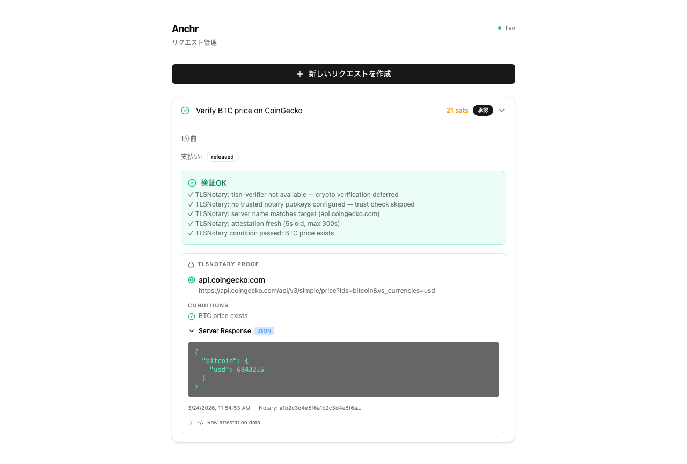

# Anchr

Decentralized marketplace for cryptographically verified data, paid with Bitcoin.

AI agents and humans buy verified API responses, price feeds, and real-world photos — with no trust required. Workers earn sats by proving what servers returned (TLSNotary) or what they saw (C2PA).

## SDK

```typescript
import { Anchr } from "anchr-sdk";

const anchr = new Anchr({ serverUrl: "https://anchr.example.com" });

const result = await anchr.query({
  description: "BTC price from CoinGecko",
  targetUrl: "https://api.coingecko.com/api/v3/simple/price?ids=bitcoin&vs_currencies=usd",
  conditions: [{ type: "jsonpath", expression: "bitcoin.usd" }],
  maxSats: 21,
});

result.verified;    // true — cryptographically proven
result.data;        // { bitcoin: { usd: 71000 } }
result.serverName;  // "api.coingecko.com" — from TLS certificate
result.proof;       // TLSNotary presentation (independently verifiable)
```

## How It Works

```
Requester (AI agent / human)
  │  "Prove what api.coingecko.com returns for BTC price"
  │  Attaches 21 sats bounty
  ▼
Nostr relay (censorship-resistant broadcast)
  │
  ▼
Worker (anyone — AI agent, server, mobile app, browser extension)
  │  Fetches URL via MPC-TLS with Verifier Server
  │  Generates cryptographic presentation (.presentation.tlsn)
  ▼
Oracle (Anchr server)
  │  Verifies TLSNotary signature
  │  Checks: domain matches, data fresh, conditions satisfied
  │  All checks pass → bounty auto-released to Worker
  ▼
Requester receives verified data + cryptographic proof
```

**No trust required.** The proof is tied to the TLS certificate — if the data is wrong, the cryptographic verification fails. Payment is atomic via Cashu HTLC escrow.

## Two Verification Modes

### Web Data (TLSNotary)

Prove what any HTTPS server returned. Workers fetch the URL through a Multi-Party Computation TLS session — the Verifier Server co-signs the session without seeing the plaintext.

<p align="center">
  
  &nbsp;&nbsp;
  
</p>

### Real-World Photos (C2PA)

Prove what a location looks like right now. Workers photograph with a C2PA-signed camera — the Content Credentials are cryptographically bound to the image, GPS, and timestamp.

## Use Cases

| Use case | Verification | Example |
|----------|-------------|---------|
| Price oracle (DeFi) | TLSNotary | Prove BTC/ETH price from CoinGecko, Binance |
| Flight status | TLSNotary | Prove flight delay for parametric insurance |
| API response proof | TLSNotary | Prove any HTTPS API returned specific data |
| Location check | C2PA + GPS | Photograph a store, intersection, event |
| Combined proof | Both | Photo of a price tag + API price verification |

## Quick Start

```bash
bun install
bun run infra:up                    # relay + blossom + verifier (docker)
bun run dev                         # server on :3000
```

Worker app (iOS / Android / Web):
```bash
cd mobile && bun install
bun run ios                         # or: bun run web
```

## API

```bash
# Web data query (TLSNotary)
curl -X POST localhost:3000/queries \
  -H "Content-Type: application/json" \
  -d '{
    "description": "BTC price from CoinGecko",
    "verification_requirements": ["tlsn"],
    "tlsn_requirements": {
      "target_url": "https://api.coingecko.com/api/v3/simple/price?ids=bitcoin&vs_currencies=usd",
      "conditions": [{"type": "jsonpath", "expression": "bitcoin.usd"}]
    },
    "bounty": {"amount_sats": 21}
  }'

# Photo query (C2PA)
curl -X POST localhost:3000/queries \
  -H "Content-Type: application/json" \
  -d '{
    "description": "渋谷スクランブル交差点の混雑状況",
    "expected_gps": {"lat": 35.6595, "lon": 139.7004},
    "max_gps_distance_km": 0.5,
    "bounty": {"amount_sats": 100}
  }'
```

<details>
<summary>Full endpoint list</summary>

| Method | Path | Description |
|--------|------|-------------|
| `GET` | `/queries` | List open queries (`?lat=&lon=&max_distance_km=`) |
| `GET` | `/queries/:id` | Query detail |
| `POST` | `/queries` | Create query |
| `POST` | `/queries/:id/upload` | Upload photo (multipart) |
| `POST` | `/queries/:id/submit` | Submit result |
| `POST` | `/queries/:id/cancel` | Cancel query |
| `GET` | `/queries/:id/attachments` | List attachments |
| `POST` | `/queries/:id/quotes` | Worker quote (HTLC flow) |
| `POST` | `/queries/:id/select` | Select worker (HTLC flow) |
| `GET` | `/health` | Health check |
| `GET` | `/oracles` | List oracles |

</details>

## Architecture

```
┌─────────────────────────────────────────────────┐
│ Requester (AI agent / human / app)              │
│   anchr.query({ targetUrl, conditions, sats })  │
└────────────────────┬────────────────────────────┘
                     │ Nostr broadcast
                     ▼
┌─────────────────────────────────────────────────┐
│ Worker (CLI / mobile app / browser extension)   │
│                                                 │
│ TLSNotary path:     Photo path:                 │
│   tlsn-prove          C2PA camera               │
│     ↕ MPC-TLS           ↓                       │
│   Verifier Server     Upload + GPS              │
│     ↓                    ↓                       │
│   .presentation.tlsn  C2PA manifest             │
└────────────────────┬────────────────────────────┘
                     │ Submit proof
                     ▼
┌─────────────────────────────────────────────────┐
│ Oracle (Anchr server)                           │
│   TLSNotary: tlsn-verifier → crypto verify      │
│   C2PA: c2patool → signature verify             │
│   Conditions: jsonpath / regex / GPS proximity  │
│   Pass → Cashu HTLC bounty released             │
└─────────────────────────────────────────────────┘
```

## Configuration

| Variable | Description |
|----------|-------------|
| `NOSTR_RELAYS` | Relay WebSocket URLs (comma-separated) |
| `BLOSSOM_SERVERS` | Blossom blob server URLs |
| `CASHU_MINT_URL` | Cashu mint for ecash payments |
| `HTTP_API_KEY` | API key for write endpoints |
| `TLSN_VERIFIER_URL` | TLSNotary Verifier Server URL |
| `TLSN_PROXY_URL` | TLSNotary WebSocket proxy URL |

## Testing

```bash
bun test                         # all tests
bun test src/                    # unit tests
bun test e2e/tlsn.test.ts       # TLSNotary E2E (real MPC-TLS)
bun test e2e/tlsn-browser.test.ts  # browser extension E2E
bun run test:regtest             # Lightning + Cashu E2E
```

## Stack

| Layer | Tech |
|-------|------|
| SDK | TypeScript (`anchr-sdk`) |
| Server | Bun + Hono |
| Messaging | Nostr (NIP-90 DVM) |
| Storage | Blossom (E2E encrypted) |
| Payment | Cashu ecash (NUT-14 HTLC) / Lightning |
| Web Verification | TLSNotary (MPC-TLS + Rust verifier) |
| Photo Verification | C2PA + EXIF + ProofMode + GPS |
| TLS Verifier Server | Rust (async-tungstenite + WsStream) |
| Mobile | React Native (Expo) + NativeWind |

## License

[MIT](LICENSE)
