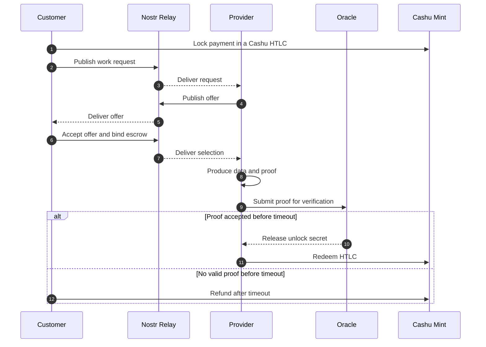

# Anchr

[](https://github.com/motxx/anchr/actions/workflows/ci.yml)
[](LICENSE)
[](specs/LICENSE)

Anchr is an SDK for verifiable paid requests. A Customer pays an unknown
Provider to fetch data, produce evidence, or take an action, and the Provider
can redeem payment only after a trusted Oracle accepts the proof.

This repository makes that flow usable for implementers. Its primary public
deliverables are `@anchr/sdk` for application developers and `@anchr/protocol`
for interoperable wire contracts. Everything else is implementation detail,
native helper code, specification material, test harness, documentation, or
optional learning material. It is not an Anchr-operated marketplace, hosted
server, wallet, oracle network, or production deployment.

It combines:

- **Nostr** for peer discovery and request/response transport
- **Cashu HTLCs** for escrow and automatic refunds
- **Oracle verification** for TLSNotary, C2PA/photo, or application-specific
  proofs

> **Status:** experimental, testnet-focused, and not production-hardened. The
> core Cashu HTLC and Nostr paths have automated coverage; TLSNotary, C2PA,
> FROST, and conditional-swap integrations are exercised by reference flows with
> narrower assumptions. See the [threat model](docs/threat-model.md).

## What It Solves

Anchr removes the pay-first / deliver-first deadlock for verifiable off-chain
work.

The Customer locks payment before work begins. The Provider can redeem only if a
trusted oracle accepts the proof. If no valid proof arrives before the timeout,
the Customer gets an automatic refund from the Cashu mint.

Anchr does not run a central server. Customers and Providers are pseudonymous
Nostr pubkeys, and each app chooses its own relay, mint, oracle, and notary.

## Repository Map

Start with `@anchr/sdk` when you want to build an app. Use `@anchr/protocol`
only when you are implementing compatible wire events, schemas, validators, or
role-neutral protocol types.

| Area | Paths | Role |
| --- | --- | --- |
| SDK | [`packages/sdk/`](packages/sdk/) | Customer, Provider, and Oracle orchestration plus standard payment, proof, attachment, adapter, and testing helpers. |
| Protocol contract | [`packages/protocol/`](packages/protocol/), [`specs/`](specs/) | Wire events, schema identifiers, validators, and role-neutral types. |
| Optional examples | [`examples/`](examples/) | Tiny learning material, when present, that demonstrates one SDK/protocol lesson for verifiable paid requests. |
| Native helpers | [`crates/`](crates/) | Rust binaries used by FROST and TLSNotary tooling. |

The target public shape is deliberately small: one SDK package and one protocol
package. See [`docs/architecture.md`](docs/architecture.md) for the current
surface classification and migration policy.

## Example Uses

- Pay an account holder to query a private API and return the response with a
  TLSNotary attestation.
- Pay someone to prove an account fact such as contribution count, karma, or
  account age without exposing the whole account.
- Build a verified photo marketplace where C2PA provenance gates payment.

## How It Works


```mermaid
sequenceDiagram
    autonumber
    participant Customer
    participant Relay as Nostr Relay
    participant Provider
    participant Oracle
    participant Mint as Cashu Mint

    Customer->>Mint: Lock payment in a Cashu HTLC
    Customer->>Relay: Publish work request
    Relay-->>Provider: Deliver request
    Provider->>Relay: Publish offer
    Relay-->>Customer: Deliver offer
    Customer->>Relay: Accept offer and bind escrow
    Relay-->>Provider: Deliver selection
    Provider->>Provider: Produce data and proof
    Provider->>Oracle: Submit proof for verification

    alt Proof accepted before timeout
        Oracle-->>Provider: Release unlock secret
        Provider->>Mint: Redeem HTLC
    else No valid proof before timeout
        Customer->>Mint: Refund after timeout
    end
```

The oracle never holds funds. It only controls whether the unlock secret is
released, so oracle trust still matters. Use solo oracles for simple flows, or a
FROST threshold signer when the trust assumption should be split.

## Install

```sh
deno add @anchr/sdk
# or
npm i @anchr/sdk
```

You also need deployment-owned infrastructure: a Cashu mint URL, Nostr relay
URL, oracle endpoint/pubkey, and Provider Nostr secret key. TLSNotary-based
schemas also need a notary. The repository supplies reference clients and
examples, not default production infrastructure.

## Quick Start

The snippet shows the Customer-side API shape. Maintained examples are optional
learning material and are kept only when they directly teach `@anchr/sdk` or
`@anchr/protocol`.

```ts
import {
  createCashuClient,
  createCustomer,
  createHttpOracleClient,
  createRelayClient,
  type CashuProof,
} from "@anchr/sdk";

const mintUrl = "https://mint.test.example";
const relayUrls = ["wss://relay.test.example"];
const oraclePubkey = "npub1exampleoraclepubkey";
const cashuProofsFromYourWallet: CashuProof[] = [];

const customer = createCustomer({
  oracles: [{
    pubkey: oraclePubkey,
    client: createHttpOracleClient({
      endpoint: "https://oracle.test.example",
    }),
  }],
  relays: relayUrls,
  mint: mintUrl,
  cashuClient: createCashuClient({ mintUrl }),
  relayClient: createRelayClient(relayUrls),
});

const { data, proof, providerPubkey } = await customer.request({
  spec: {
    schema: "https://anchr-spec.org/spec/proof/tlsn/v1",
    predicate: {
      target: "https://api.github.com/users/alice",
      conditions: [{ path: "$.public_repos", op: ">", value: 10 }],
    },
  },
  payment: { maxAmount: 1000 },
  sourceProofs: cashuProofsFromYourWallet,
});
```

For multiple trusted oracles, keep the whitelist and its matching transport in
one `oracles` list:

```ts
import {
  createCashuClient,
  createCustomer,
  createHttpOracleClient,
  createRelayClient,
} from "@anchr/sdk";

const mintUrl = "https://mint.test.example";
const relayUrls = ["wss://relay.test.example"];
const oracleA = "npub1exampleoraclea";
const oracleB = "npub1exampleoracleb";

const multiOracleCustomer = createCustomer({
  oracles: [
    {
      pubkey: oracleA,
      client: createHttpOracleClient({
        endpoint: "https://oracle-a.test.example",
      }),
    },
    {
      pubkey: oracleB,
      client: createHttpOracleClient({
        endpoint: "https://oracle-b.test.example",
      }),
    },
  ],
  relays: relayUrls,
  mint: mintUrl,
  oracleSelector: (oracles: readonly string[]) => oracles[1] ?? oracles[0],
  cashuClient: createCashuClient({ mintUrl }),
  relayClient: createRelayClient(relayUrls),
});
```

Providers use `createProvider(...)` and attach a proof producer for the
requested schema. That Provider process can be long-running, because it must
receive Customer requests and produce proofs, but it is not an Anchr-operated
middleman.

## Verification Schemas

The SDK does not bake in a proof format. Each request carries a schema URL, and
the Provider and Oracle interpret it.

| Schema                   | Use case                                   |
| ------------------------ | ------------------------------------------ |
| `https://anchr-spec.org/spec/proof/tlsn/v1` | TLSNotary attestation of an HTTPS response |
| `https://anchr-spec.org/spec/proof/c2pa-image/v1` | C2PA-signed photo/video provenance and GPS |

## Examples

Status labels are defined in
[`docs/universality-boundaries.md`](docs/universality-boundaries.md#example-status-vocabulary).
The checklist for promoting or maintaining an advertised example lives in
[`docs/example-delivery-lifecycle.md`](docs/example-delivery-lifecycle.md).

No maintained examples are advertised right now. New examples must be tiny
lessons for verifiable paid requests and must use only `@anchr/sdk` or
`@anchr/protocol` for Anchr imports.

## More Detail

- [Architecture](docs/architecture.md) - layer boundaries and design notes
- [Threat model](docs/threat-model.md) - trust assumptions and mitigations
- [Wire spec](specs/) - protocol shapes, event kinds, and payloads
- [Contributing](CONTRIBUTING.md) - local stack and test commands

## License

Code: [MIT](LICENSE). Specs: [CC0](specs/LICENSE), so anyone may implement them.
