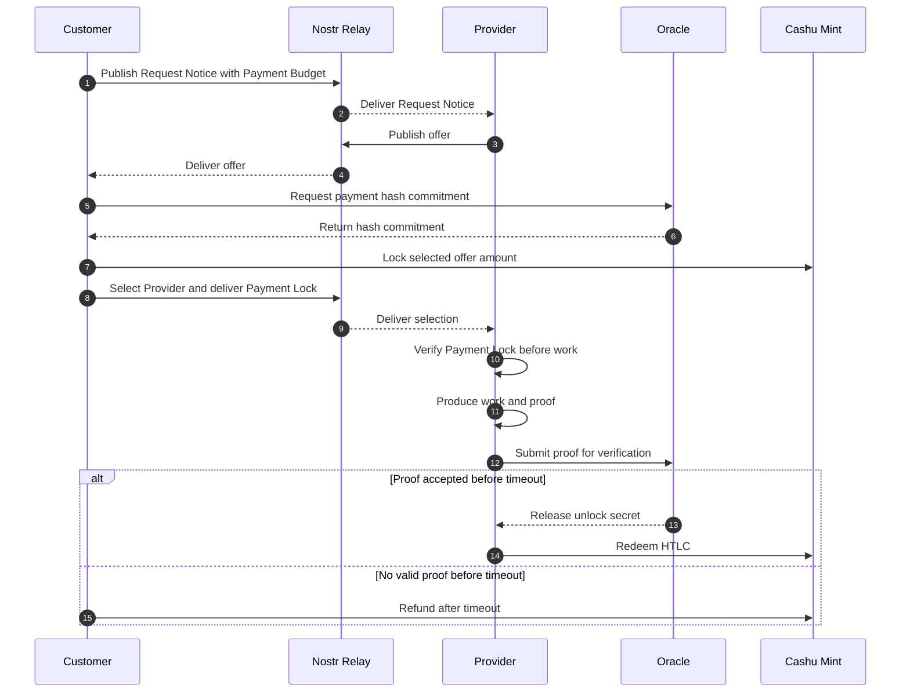

# Anchr

[](https://github.com/motxx/anchr/actions/workflows/ci.yml)
[](LICENSE)
[](specs/LICENSE)

Anchr is an SDK for verifiable paid requests. A Customer publishes a payment
budget, selects one Provider, and locks payment for that Provider's Requested
Payment Amount. The Provider returns work with proof, and the Provider can
redeem only after a trusted Oracle accepts the proof. It removes the pay-first /
deliver-first deadlock for verifiable off-chain work.

The public deliverables are `@anchr/sdk` for application developers and
`@anchr/protocol` for interoperable wire contracts. Anchr is not a hosted
service; each app chooses its own relay, mint, oracle, and notary.

It combines:

- **Nostr** for peer discovery and request/response transport
- **Cashu HTLCs** for Payment Locks and automatic refunds
- **Oracle verification** for TLSNotary, C2PA/GPS images, or application-specific proofs

> **Status:** experimental and testnet-focused. See the
> [threat model](docs/threat-model.md) before treating any flow as production
> infrastructure.

## How It Works


```mermaid
sequenceDiagram
    autonumber
    participant Customer
    participant Relay as Nostr Relay
    participant Provider
    participant Oracle
    participant Mint as Cashu Mint

    Customer->>Relay: Publish Request Notice with Payment Budget
    Relay-->>Provider: Deliver Request Notice
    Provider->>Relay: Publish offer
    Relay-->>Customer: Deliver offer
    Customer->>Oracle: Request payment hash commitment
    Oracle-->>Customer: Return hash commitment
    Customer->>Mint: Lock selected offer amount
    Customer->>Relay: Select Provider and deliver Payment Lock
    Relay-->>Provider: Deliver selection
    Provider->>Provider: Verify Payment Lock before work
    Provider->>Provider: Produce work and proof
    Provider->>Oracle: Submit proof for verification

    alt Proof accepted before timeout
        Oracle-->>Provider: Release unlock secret
        Provider->>Mint: Redeem HTLC
    else No valid proof before timeout
        Customer->>Mint: Refund after timeout
    end
```

The Oracle never holds funds. It only controls whether the unlock secret is
released, so oracle trust still matters. Use solo oracles for simple flows, or a
FROST threshold signer when the trust assumption should be split.

## Trust Assumptions

Anchr removes the pay-first / deliver-first deadlock, but it is not fully
trustless. Production deployments must choose and monitor two trust roots:

- **Oracle release authority:** INV-02 guarantees that the honest SDK Oracle
  wrapper does not release the Cashu HTLC preimage when verification fails. A
  malicious solo Oracle, or a colluding FROST threshold, can still sign the
  wrong outcome outside that wrapper.
- **Cashu Mint custody:** the current settlement path trusts one Cashu Mint for
  solvency and HTLC enforcement. The Mint layer alternatives and their tradeoffs
  are tracked in the threat model.

## Example Uses

- Pay an account holder to query a private API and return the response with a
  TLSNotary attestation.
- Pay a field worker to submit a C2PA-signed photo whose manifest binds GPS to
  the requested location.
- Pay someone to prove an account fact such as contribution count, karma, or
  account age without exposing the whole account.
- Build application-specific proof flows behind your own schema URL and Oracle
  policy.

## Install

```sh
deno add @anchr/sdk
# or
npm i @anchr/sdk
```

You also need deployment-owned infrastructure: a Cashu mint URL, Nostr relay
URL, oracle pubkey, and Provider Nostr secret key. TLSNotary-based schemas
also need a notary.

## Quick Start

From a clean checkout (with [Deno](https://deno.com/) installed), run the
browser Customer / server Provider example:

```sh
git clone https://github.com/motxx/anchr && cd anchr
deno task -c examples/browser-customer-server-provider/deno.json stack:up
deno task -c examples/browser-customer-server-provider/deno.json stack:init
cargo build --manifest-path crates/tlsn-prover/Cargo.toml
cargo build --release --manifest-path crates/tlsn-verifier/Cargo.toml
deno task -c examples/browser-customer-server-provider/deno.json smoke
```

The command builds a browser bundle, starts a local Deno server running
`createProvider()`, opens a real browser running `createCustomer()`, and asserts
that the Customer receives a TLSNotary-backed result while the Provider redeems
a real regtest Cashu HTLC.

## Customer API Sketch

```ts
import {
  createCashuClient,
  createCustomer,
  createRelayClient,
  ProofSchema,
  type CashuProof,
} from "@anchr/sdk";

const mintUrl = "https://mint.test.example";
const relayUrls = ["wss://relay.test.example"];
const oraclePubkey = "npub1exampleoraclepubkey";
const cashuProofsFromYourWallet: CashuProof[] = [];

const customer = createCustomer({
  // The Oracle hash bootstrap rides the relay as NIP-44 DMs by default;
  // pass `client: createHttpOracleClient(...)` to use an HTTP oracle.
  oracles: [{ pubkey: oraclePubkey }],
  relays: relayUrls,
  mint: mintUrl,
  cashuClient: createCashuClient({ mintUrl }),
  relayClient: createRelayClient(relayUrls),
});

const { data, proof, providerPubkey } = await customer.request({
  spec: {
    schema: ProofSchema.TlsnV1,
    predicate: {
      target: "https://api.github.com/users/alice",
      conditions: [{ path: "$.public_repos", op: ">", value: 10 }],
    },
  },
  payment: { maxAmount: 1000 },
  fundingProofs: cashuProofsFromYourWallet,
});
```

For the full Customer, Provider, Oracle, payment, proof, and testing APIs, see
[`packages/sdk/README.md`](packages/sdk/README.md). For wire contracts and
schema identifiers, use `@anchr/protocol` and [`specs/`](specs/).

## Repository Map

| Area | Paths | Role |
| --- | --- | --- |
| SDK | [`packages/sdk/`](packages/sdk/) | Customer, Provider, Oracle, payment, proof, attachment, adapter, and testing helpers. |
| Protocol | [`packages/protocol/`](packages/protocol/), [`specs/`](specs/) | Nostr wire events, Cashu settlement fields, schema identifiers, validators, and protocol types. |
| Native helpers | [`crates/`](crates/) | Rust binaries used by FROST and TLSNotary tooling. |

See [`docs/architecture.md`](docs/architecture.md) for package boundaries and
public-surface policy.

## Examples

Status labels are defined in
[`docs/universality-boundaries.md`](docs/universality-boundaries.md#example-status-vocabulary).

| Example | Status | Lesson |
| --- | --- | --- |
| [`browser-customer-server-provider`](examples/browser-customer-server-provider/) | Implemented | Run browser `createCustomer()` against server `createProvider()` with Docker Nostr relay, regtest Cashu mint, SDK Oracle, and TLSNotary proof verification. |

New examples must be tiny lessons for verifiable paid requests and must use
only `@anchr/sdk` or `@anchr/protocol` for Anchr imports.

## More Detail

- [Documentation index](docs/README.md) - public docs and maintainer workflow
- [Architecture](docs/architecture.md) - layer boundaries and design notes
- [Threat model](docs/threat-model.md) - trust assumptions and mitigations
- [Wire spec](specs/) - protocol shapes, event kinds, and payloads
- [Contributing](CONTRIBUTING.md) - local stack and test commands

## License

Code: [MIT](LICENSE). Specs: [CC0](specs/LICENSE), so anyone may implement them.
