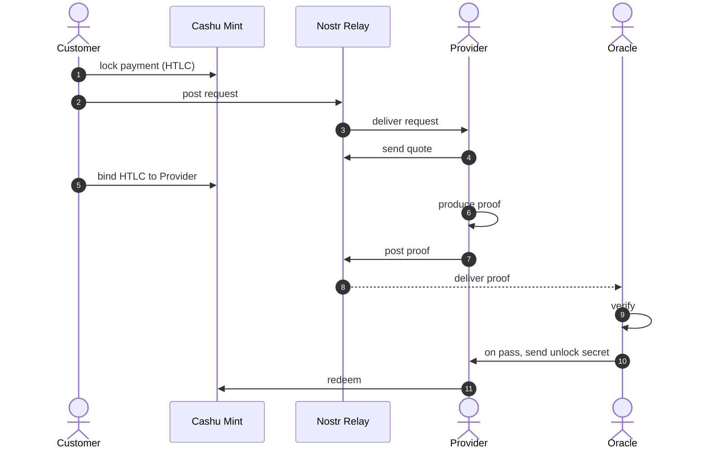

# Anchr

[](https://github.com/motxx/anchr/actions/workflows/ci.yml)
[](LICENSE)
[](specs/LICENSE)

Anchr is an SDK for P2P verified work — pay a stranger to fetch data or
take an action you can't, with payment released only when they prove
they did, atomic over Nostr.

> **Status: experimental.** Testnet only. SDK API design in progress;
> packages may change.

## What you can build

A Customer pays a Provider for something the Customer can't obtain
alone, with payment held in escrow until the proof verifies.

- **Authenticated API proxy** — Pay an account holder to query a private
  API on their own data (bank balance, exchange order history, paid
  subscription content) and return the response with a TLSNotary
  attestation — a cryptographic proof that the HTTPS server actually
  returned that response, signed by a third-party notary that didn't
  see the plaintext.
- **Self-attested presence** — Pay someone to prove a fact only they can
  show: GitHub contribution count, Reddit karma, account age. For
  airdrop sybil-resistance or gated access without doxxing.

## What problem it solves

**Atomic exchange.** Pay-first risks getting nothing; deliver-first
risks not getting paid. Anchr removes the deadlock: payment releases iff
a valid proof exists, and refunds automatically if no proof arrives
before the locktime of the Cashu HTLC (a hash-time-locked escrow:
spendable with the unlock secret, or refunded after the timeout).
Neither side can cheat — the Customer can't withhold after a valid
proof, and the Provider can't get paid without one.

**No middleman.** Anchr runs no server. Customer and Provider are
pseudonymous Nostr pubkeys, and they pick every external service
themselves: Nostr relay, Cashu mint, oracle, TLSNotary notary. Anchr the
project cannot censor, surveil, or be subpoenaed about a transaction it
never sees.

## How it works

The exchange has three active roles. Anchr is none of them — the SDK
only wires them together.

- **Customer** — locks payment up front, receives verified data.
- **Provider** — produces the proof, redeems the payment against it.
- **Oracle** — verifies the proof and reveals the payment-unlock
  secret. Customer and Provider each whitelist oracles they trust,
  and the SDK picks one from the intersection. Run solo, or split
  trust across a FROST (threshold-signing) t-of-n cluster.

**The Oracle never holds funds — only the secret that unlocks them.**
A misbehaving Oracle can't steal payments; the worst case is collusion
with a Provider to leak the secret without a real proof verification.
For collusion bounds and threat assumptions, see
[docs/threat-model.md](docs/threat-model.md).

Plus two or three pieces of vanilla infrastructure: a **Cashu mint**
holds the payment in an HTLC, a **Nostr relay** carries every message,
and (for TLSN-based schemas only) a **TLSNotary notary** mediates the
Provider's TLS proof session.


```mermaid
sequenceDiagram
    autonumber
    actor C as Customer
    participant M as Cashu Mint
    participant R as Nostr Relay
    actor P as Provider
    actor O as Oracle

    C->>M: lock payment (HTLC)
    C->>R: post request
    R->>P: deliver request
    P->>R: send quote
    C->>M: bind HTLC to Provider
    P->>P: produce proof
    P->>R: post proof
    R-->>O: deliver proof
    O->>O: verify
    O->>P: on pass, send unlock secret
    P->>M: redeem
```

If no valid proof arrives before the HTLC's locktime, the Customer's
funds refund automatically.

Wire-compatible with
[NIP-90 DVM](https://github.com/nostr-protocol/nips/blob/master/90.md)
(Nostr's request/response market protocol) event kinds — 5300 =
request, 6300 = result, 7000 = status — so DVM-aware clients can
interoperate.

For wire-format details (event kinds, payload shapes, oracle discovery,
conditional-swap primitive), see [`specs/`](specs/). For the layer
dependency rules and composition patterns, see
[`docs/architecture.md`](docs/architecture.md).

## Install

```sh
deno add @anchr/sdk
# or
npm i @anchr/sdk
```

You'll also need: a Cashu mint URL, a Nostr relay URL, an oracle (HTTP
endpoint + pubkey) to whitelist, and a Nostr secret key (Providers
only). See [`example/`](example/) for a runnable test setup with all
of these wired up.

## Components (you choose)

The SDK does not bundle these — you pass URLs/pubkeys at construction
time. Run your own, or use third-party infrastructure.

| Component | Role | Required for | Self-host or use |
|---|---|---|---|
| **Oracle** | Verifies proof, releases the unlock secret | All | `crates/frost-signer` (solo or FROST t-of-n) |
| **Relay** | Nostr transport | All | strfry, nostr-rs-relay, public relays |
| **Mint** | Cashu HTLC escrow | All | nutshell, cashu-rs-mint, public test mints |
| **Notary** | TLS proof session mediator | TLSN only | `crates/tlsn-*`, or any compatible notary |

## Quick start

The snippets below show API shape only. For runnable Customer/Provider
code (with adapter setup), see
[`example/c2pa-media-verification/`](example/c2pa-media-verification/).

```ts
// Customer side — the SDK generates an ephemeral Nostr key per request,
// so no privKey is needed here.
import { createCustomer, createHttpOracleClient } from "@anchr/sdk";

const customer = createCustomer({
  oracles: ["npub1oracle1...", "npub1oracle2..."],  // whitelist
  relays:  ["wss://relay.example.org"],
  mint:    "https://mint.example.org",  // SDK builds a Cashu client from this
  oracleClient: createHttpOracleClient({
    endpoint:     "https://oracle.example.org",
    oraclePubkey: "npub1oracle1...",
  }),
});

const { data, proof, providerPubkey } = await customer.request({
  spec: {
    schema: "io.anchr.tlsn-https.v1",
    predicate: {
      target: "https://api.github.com/users/alice",
      conditions: [{ path: "$.public_repos", op: ">", value: 10 }],
    },
  },
  payment: { maxAmount: 1000 },  // sats; cheapest quote up to this is picked
});
```

The Customer broadcasts to any Provider subscribed to the schema. The
SDK auto-selects the cheapest valid quote; pass `provider: "npub1..."`
to target a specific Provider directly. Customer and Provider config
fields differ slightly (Provider keeps a stable Nostr key for
redemption; Customer signs with an ephemeral one) — see the SDK's
`CustomerOptions` / `ProviderOptions` types.

```ts
// Provider side
import { createProvider } from "@anchr/sdk";

const provider = createProvider({
  oracles: ["npub1oracle1...", "npub1oracle2..."],
  notary:  "wss://notary.example.org",  // TLSN-based schemas only
  relays:  ["wss://relay.example.org"],
  mint:    "https://mint.example.org",
  privKey: "nsec1...",
});

await provider.serve(async (request) => {
  return {
    amountSats: 100,  // asking price for this request
    produce: async () => {
      // Match request.spec.schema to a proof producer
      // (e.g. @anchr/tlsn-toolkit for io.anchr.tlsn-https.*).
      return await produceProof(request.spec);  // returns { data, proof }
    },
  };
});
```

## Verification schemas

The SDK does not bake in any verification format. Each request carries
a `schema` URI; Provider and Oracle interpret it. New formats plug in
by publishing a schema, not by upgrading the SDK.

| Schema | Use case |
|---|---|
| `io.anchr.tlsn-https.v1` | TLSNotary attestation of an HTTPS response |
| `io.anchr.c2pa-image.v1` | C2PA (Coalition for Content Provenance and Authenticity)-signed photo / video, with cryptographic provenance back to the capture device. Optional GPS predicate. |

Schemas are themselves Nostr events (versioned and discoverable by URI),
defining the predicate shape, proof format, and verification rules.

## Composition patterns

`@anchr/sdk` (Customer/Provider) is the headline shape, but Anchr's
primitives compose into four shapes — each serving a different
counterparty topology:

1. **Bounty** (1:N, single-hop) — one Customer pays one of many
   competing Providers for verified data. The default `@anchr/sdk` flow.
2. **Chained Bounty** (N hops) — a chain of Customer/Provider
   transactions where each hop verifies the prior hop's attestation
   and adds its own. Settlement happens at every hop (or off-protocol
   for fiat-leg cases).
3. **Conditional Swap / Market** (2-party, bilateral) — both parties
   lock counter-tokens against opposing outcomes; an oracle reveals one
   preimage and the winner sweeps. **Narrow scope on purpose**: tied to
   verifiable events. Continuous order books, AMMs, and dynamic-
   counterparty matching are out of scope — Lightning + DLC fits those
   better.
4. **Verification-only** (no payment) — attestation chains that don't
   need settlement (sybil shielding, audit trails).

## Examples

Status reflects current implementation; see each example's README for
what runs today.

### Bounty (Customer/Provider, single-hop)

| Product | Status |
|---|---|
| Verifiable photo marketplace ([C2PA](example/c2pa-media-verification/)) | Testnet |
| Browser auto-claim ([Auto-claim](example/auto-claim/)) | Concept |
| Fiat → BTC swap ([Watari](example/tlsn-fiat-swap-square/)) | Concept (TLSN-on-Square compatibility risk) |

### Chained Bounty (multi-hop, settlement per hop)

| Product | Status |
|---|---|
| [Royalty distribution](example/royalty-distribution/) | Composition sketch |
| [Supply-chain proof](example/supply-chain-proof/) | Composition sketch |

Each hop is a Customer/Provider transaction (settlement on-protocol
via Cashu, or off-protocol fiat for supply-chain finance); the chain
itself is application-orchestrated.

### Conditional Swap / Market (2-party, bilateral)

| Product | Status |
|---|---|
| Two-party binary bet ([Kannagi](example/two-party-binary-bet/)) | Testnet |

Uses `@anchr/cashu-conditional-swap` directly (no `@anchr/sdk` —
Customer/Provider doesn't fit symmetric counterparties). FIFO matching
queue pairs YES/NO bets at fixed 1:1 odds.

### Verification-only (attestations, no settlement)

| Product | Status |
|---|---|
| Airdrop sybil resistance ([Katashiro](example/airdrop-bot-shield/)) | Simulation |

## Underlying packages

**User-facing — Bounty / Chained Bounty:**

| Package | Purpose |
|---|---|
| [`@anchr/sdk`](packages/sdk/) | Customer/Provider orchestration (main entry) |
| [`@anchr/tlsn-toolkit`](packages/tlsn-toolkit/) | TLSNotary proof producer/verifier |
| [`@anchr/photo-verification`](packages/photo-verification/) | C2PA + GPS + ProofMode + EXIF + AI heuristic |

**User-facing — Conditional Swap / Market:**

| Package | Purpose |
|---|---|
| [`@anchr/cashu-conditional-swap`](packages/cashu-conditional-swap/) | Cross-lock primitive (HTLC + FROST P2PK) for verifiable-outcome bilateral swaps |
| [`@anchr/frost-oracle`](packages/frost-oracle/) | FROST t-of-n threshold signing wrapper |

**Host-side / internal — usually you don't import directly:**

| Package | Purpose |
|---|---|
| [`@anchr/runtime`](packages/runtime/) | Anchr role runtime — Query lifecycle, escrow, oracle-client/service, worker-api (HTTP), MCP (stdio). Embed via `composeHost(extras)` |
| [`@anchr/core-cashu`](packages/core-cashu/) | Cashu HTLC escrow primitives |
| [`@anchr/blossom`](packages/blossom/) | Encrypted attachment store (BUD-01–06 client) |
| [`@anchr/core-runtime`](packages/core-runtime/) | Cross-runtime helpers (spawn, fs, which, env, logger) |

Plus Rust crates: `crates/frost-signer` (FROST signing daemon),
`crates/tlsn-*` (TLSNotary integrations).

## Reference

- [Architecture](docs/architecture.md) — layer dependencies and
  composition patterns
- [Threat model](docs/threat-model.md) — attacker assumptions and
  mitigations
- [Wire spec](specs/) — protocol on the wire (CC0, anyone may implement)
- [Contributing](CONTRIBUTING.md) — local stack, test commands

## License

Code: [MIT](LICENSE) · Specs: [CC0](specs/LICENSE) — anyone may implement.
