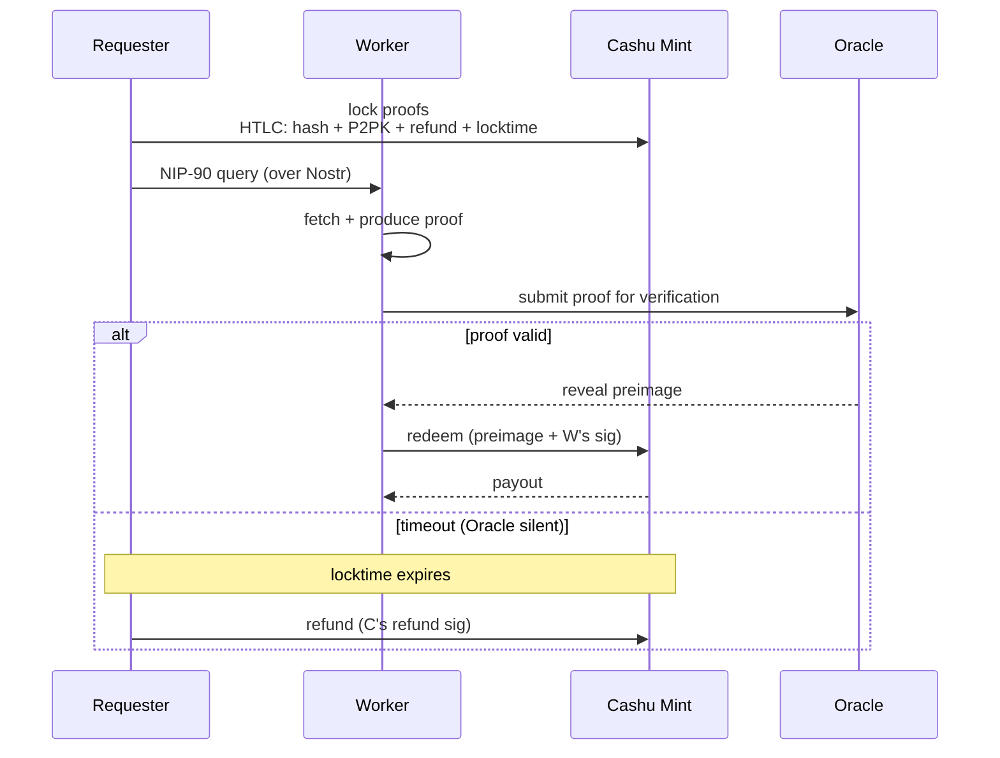
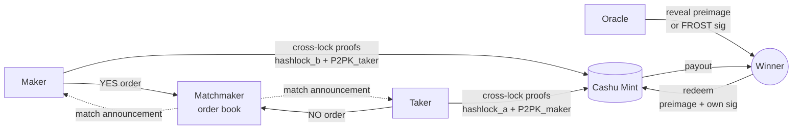
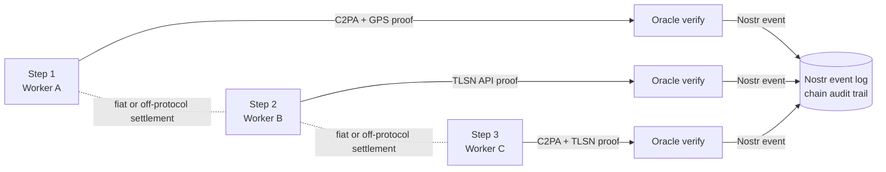

# Architecture

Anchr is seven independently typecheckable packages, plus a reference
Hono / Deno server that composes them as one example deployment. No
package depends on host-side code; each is isolated under `deno task
test:packages`.

```
packages/
├── core-runtime/              Bun ↔ Deno runtime helpers (spawn, fs, which, logger, env)
├── core-cashu/                Cashu HTLC escrow + preimage store
├── tlsn-toolkit/              TLSNotary application layer (validation, replay defence, ReDoS guard)
├── photo-bounty/              C2PA + EXIF + ProofMode + AI content check + GPS Haversine
├── cashu-frost-oracle/        FROST t-of-n cluster wrapper for Cashu P2PK threshold signing
├── cashu-conditional-swap/    N:M binary-outcome conditional swap primitive (HTLC / FROST dual-key)
└── sdk/                       anchr-sdk: HTTP / MCP client for AI agents

src/                           Reference host server (Hono on Deno) — composes the packages above
example/                       Runnable examples; each has its own `deno.json`
crates/                        Rust: frost-signer, tlsn-prover, tlsn-server, tlsn-verifier
specs/                         Wire-format specs (CC0)
docs/                          Implementation guides + threat model
```

## What each surface looks like today

| Surface | State |
|---|---|
| Cashu HTLC payment + escrow | Implemented, fuzzed (`e2e/regtest-htlc-attacks.test.ts`) |
| TLSNotary proof verification | Implemented (replay-protected, ReDoS-safe conditions) |
| FROST t-of-n threshold oracles | Implemented (`crates/frost-signer`, BIP-340 Schnorr) |
| C2PA / ProofMode / GPS / EXIF | Implemented |
| Nostr DVM (NIP-90) discovery | Implemented |
| Blossom (NIP-44 + AES-256-GCM) | Implemented |

Active development; baseline tests are green and threat-model invariants
are tracked. API stability is not yet guaranteed.

## Attachment registry (Blossom integration)

The reference host bundles a Blossom client (`src/infrastructure/blossom/`,
~540 LOC) as the **encrypted attachment registry** for proofs that
don't fit in Nostr events. Without it, the bounty composition can
still carry small inline data, but anything photo-sized, large TLSN
presentations, or ProofMode bundles needs an out-of-event store.

What it provides:

- **Content-addressed storage** — SHA-256 of ciphertext is the address;
  same content has the same hash on any Blossom server
- **Server-blind encryption** — AES-256-GCM with random per-blob key
  and IV; Blossom servers see only ciphertext
- **Key delivery via NIP-44** — the decryption key is encrypted to the
  Oracle and the Requester (per `blossom_keys` field in the QueryResponse
  payload, see [`specs/messaging.md`](../specs/messaging.md))
- **Multi-server redundancy** — `blossom_servers` lists every server
  the blob was uploaded to; download tries them in order

Used by every example that ships large proof bytes (c2pa-media,
fiat-swap, the e2e regtest tests). Future verification-only chains
(royalty distribution, supply-chain) will store per-edge TLSN
presentations the same way, so anyone holding the chain's product /
content ID can later fetch the proof bytes from Blossom and re-verify
without privileged access.

**Pluggability:** the wire spec uses `storage_kind: "blossom" | "external"`,
so a host can implement an alternative attachment backend (S3, IPFS,
custom) and stay protocol-compatible. The reference host's choice is
Blossom because it is content-addressed, NIP-44-friendly, and already
deployed in the Nostr ecosystem. Spec details:
[`docs/host-storage.md`](host-storage.md).

The integration lives at `src/infrastructure/blossom/` rather than in
its own package because every current consumer reaches it through the
reference host — either via the HTTP routes (`/queries/:id/upload`,
`/queries/:id/attachments`) or the SDK that wraps them. A future use
case that wants the encrypted Blossom primitive without the
surrounding bounty / oracle wiring — a standalone uploader publishing
proofs directly to Blossom and a Nostr relay, for example — would be
the natural moment to lift it into `packages/`.

## Specs and threat model

- Wire-format specs (Nostr DVM messaging, conditional-swap primitive,
  oracle registry) live under [`specs/`](../specs/), CC0. Anyone may
  implement them.
- Per-package implementation guides are each package's `SPEC.md`
  (e.g. [`packages/core-cashu/SPEC.md`](../packages/core-cashu/SPEC.md),
  [`packages/tlsn-toolkit/SPEC.md`](../packages/tlsn-toolkit/SPEC.md)).
- Threat-model invariants and the attack tests pinning them are in
  [`docs/threat-model.md`](threat-model.md).

## Relation to NIP-90

Anchr is, in one line: **NIP-90 (Nostr DVM) + Cashu HTLC settlement +
Oracle-verified proofs**. Three concrete additions to what NIP-90
already provides:

| Layer | What NIP-90 provides | What Anchr adds |
|---|---|---|
| Transport | Request/Result/Feedback events (kinds 5xxx/6xxx/7000), provider competition, encrypted parameters via NIP-44, capability advertisement via NIP-89 | (uses NIP-90 as is) |
| Settlement | "money in, data out" loosely via Lightning zap — post-delivery, trust-based | **Cashu HTLC pre-lock with locktime refund** (`packages/cashu-conditional-swap`) — atomic settlement, escrow guarantees |
| Verification | None — the customer trusts the provider | **Standardized proof types** (`packages/photo-bounty` for C2PA/GPS/ProofMode; `packages/tlsn-toolkit` for TLSNotary) |
| Trust topology | Bilateral (customer ↔ provider) | **Oracle as a third role** that verifies the proof and gates the HTLC release. t-of-n FROST (`packages/cashu-frost-oracle`) for higher-stakes queries |

Anchr is not strictly NIP-90-conformant: it uses NIP-90 kind ranges
with custom semantics (e.g. kind 5300 is reserved for "Nostr Content
Discovery" in the public DVM kind registry; Anchr currently overloads
it for verifiable data queries). Treat NIP-90 here as the **transport
choice**, not a strict-compatibility claim — Anchr could in principle
run over a different transport (HTTP, MQTT) and would still be Anchr.

NIP-90 was chosen because the request/quote/result/feedback flow is
already designed for competing providers, NIP-89 advertises capability
discovery, and NIP-44 covers encrypted parameters. Reusing this saves
inventing a parallel transport — which is the umbrella point: Anchr
borrows where standards exist, adds where they don't.

## Composition patterns

Anchr is a set of independent packages that compose into different
patterns depending on the use case. Three patterns are demonstrated in
`example/`. The first two share the same invariant — **the Cashu Mint
is the only party that moves money; the Oracle only reveals secrets** —
the third skips Cashu entirely.

### Bounty (asymmetric: one buyer, competing workers)

A Requester locks payment in escrow and competing Workers race to
fulfill the query. The Oracle verifies the submitted proof and reveals
the preimage that lets the winning Worker redeem.



Used by: query/data examples (C2PA, supply-chain, auto-claim, fiat-swap).

### Market (symmetric: two counterparties, matched bilaterally)

Two bettors take opposite sides of a binary outcome. A matchmaker pairs
them but never touches funds. Each bettor performs a **bilateral
cross-lock** at the Mint: their tokens are locked under the
*counterparty's* pubkey and the *opposite outcome's* hash. The Oracle
reveals one preimage (or FROST signature) — the winner uses it plus
their own signature to redeem the loser's locked token.



Used by: prediction-market (`example/prediction-market/`). Imports
`@anchr/cashu-conditional-swap` + `@anchr/cashu-frost-oracle` directly
(no SDK).

### Verification-only chain (no Cashu)

Some use cases want Anchr's verification primitives without on-protocol
settlement. A multi-hop evidence chain — supply-chain audit, news
provenance, document authenticity — uses `photo-bounty` and
`tlsn-toolkit` to produce per-hop attestations linked through Nostr,
but settlement happens off-protocol (typically fiat invoices in
supply-chain finance, or no settlement at all in pure audit chains).



Used by:

- **`example/royalty-distribution/`** — recursive R/W/O across the
  edges of a content rights graph (composer / lyricist / performer /
  producer; sample / derivative chains). Designed to use
  `@anchr/tlsn-toolkit` + Nostr event conventions. Per-edge atomic
  settlement in sats is opt-in. The cleanest fit for the
  verification-only chain pattern: fully digital, no physical-binding
  gap.
- **`example/supply-chain-proof/`** — recursive R/W/O along a
  physical multi-hop supply chain. Designed to use
  `@anchr/photo-bounty` + `@anchr/tlsn-toolkit`. Same pattern as
  royalty-distribution, but in the physical domain — useful precisely
  because it surfaces the photo-to-shipment binding gap that
  fully-digital verification chains don't have.

Both **do not use** `cashu-conditional-swap`.

**Why the three-way distinction matters**: it makes Anchr's umbrella
nature explicit. Bounty and Market are settlement compositions
(payment is on-protocol via Cashu); Verification-only is a
non-settlement composition (Anchr provides only the verification
layer). Future use cases will likely be variations on these three
shapes, mixing the same primitives differently.
