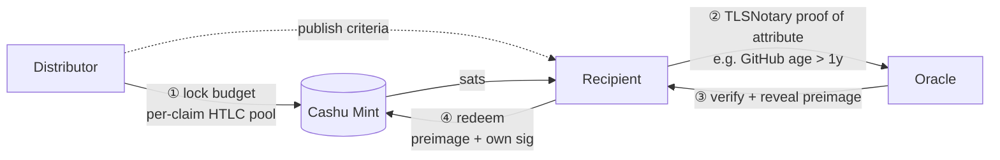

# 形代(Katashiro)

> *Katashiro* — a paper effigy in Japanese tradition that absorbs a person's impurities so the person stays anonymous. Here: a cryptographic stand-in for identity.

**Airdrop bot shield.**

> **Status: Mainnet-capable operator preview.** The demo remains available,
> but the example now includes a durable HTTP verifier service with SQLite
> persistence, TLSNotary sidecar verification, replay protection, per-account
> nullifiers, and mainnet startup guards.

> **Uses:** `@anchr/tlsn-toolkit` + Cashu HTLC preimage release.
> **Pattern:** bounty (Project pays each verified Claimant on TLSN-attested Web2 attribute).

TLSNotary-based Sybil resistance for token airdrops — prove you're human without revealing who you are.

## Problem

Token airdrops distribute governance tokens to real users — and they're heavily exploited.

**Real-world damage:**

- **LayerZero (2024)** — Excluded 1.2M wallets (>80% of snapshots) as suspected Sybils. Despite months of self-reporting and cluster analysis, the team still couldn't distinguish all bots from real users.
- **Arbitrum (2023)** — Sybil farmers captured an estimated $5M+ in $ARB. One cluster of wallets bridged minimal amounts across 1,000+ addresses to qualify.
- **Optimism (2023)** — Multiple rounds of airdrop farming operations documented, with professional operations using hundreds of wallets and scripted interactions.
- **Hop Protocol (2022)** — Despite detailed on-chain criteria, coordinated farming operations extracted significant portions of the airdrop allocation.

The core issue: **on-chain behavior is trivially faked**. A bot can bridge tokens, swap on DEXes, and interact with contracts just as cheaply as a real user. Any criteria based solely on on-chain activity can be gamed at scale.

## Solution

Anchr's TLSNotary proof system lets airdrop claimants cryptographically prove attributes from existing Web2 accounts (GitHub, Twitter, etc.) without revealing their identity. Combined with Cashu HTLC escrow, this creates a Sybil-resistant pipeline for trustless token distribution.

**Key insight:** A GitHub account with 3 years of history, 50+ repos, and 500+ contributions is economically impractical to fake. A Twitter account with 1,000+ organic followers costs far more than an airdrop allocation is worth. TLSNotary lets us verify these attributes cryptographically without requiring users to link their Web2 identity to their wallet.

## How It Works

### 3-Step Flow

```
1. PROJECT defines airdrop criteria
   "GitHub account > 1 year old, > 10 repos, > 100 contributions"

2. CLAIMANT generates TLSNotary proofs
   Visits https://api.github.com/users/{username} in TLSNotary extension
   MPC-TLS session proves the JSON response without revealing it to the verifier

3. VERIFIED CLAIM releases tokens via Cashu HTLC
   Oracle verifies proof → releases preimage → claimant redeems escrowed tokens
```



The Oracle never holds budget; the Mint releases tokens only against a
preimage the Distributor pre-committed at lock time. If the Oracle goes
silent or the Distributor walks away, the Distributor recovers the pool
via the locktime refund path.

### Supported Proof Types

| Proof Type | Target URL | JSONPath | What It Proves |
|------------|-----------|----------|----------------|
| GitHub account age | `https://api.github.com/users/{user}` | `created_at` | Account existed before a date |
| GitHub repos | `https://api.github.com/users/{user}` | `public_repos` | User has N+ public repos |
| GitHub followers | `https://api.github.com/users/{user}` | `followers` | N+ followers (social proof) |
| Twitter followers | `https://api.x.com/2/users/{id}?user.fields=public_metrics` | `data.public_metrics.followers_count` | Social proof (N+ followers) |

> Note: per-user contributions count is not in the `/users/{user}` REST response — it requires the GraphQL API or contributions calendar scrape, which is out of scope for the basic flow shown here.

### Architecture

```
Project (token issuer)                   Claimant (wants tokens)
+---------------------+                 +----------------------+
| 1. Define criteria  |                 | 2. Generate proofs   |
|    - GitHub > 1yr   |                 |    per condition     |
|    - 10+ repos      |                 |                      |
|    - 100+ contribs  |                 |  github.com/users/me |
|                     |                 |  -> TLSNotary proof  |
| 3. Lock tokens in   |                 |                      |
|    Cashu HTLC       |                 | 4. Submit proofs     |
|    escrow pool      |                 |    to Anchr          |
+---------------------+                 +----------------------+
         |                                       |
         |             +-----------+             |
         +------------>|   Anchr   |<------------+
                       |   Oracle  |
                       |           |
                       | Verify:   |
                       |  TLS sig  |
                       |  domain   |
                       |  jsonpath |
                       |  freshness|
                       +-----------+
                            |
                   All conditions pass?
                       /         \
                     YES          NO
                      |            |
               Release HTLC    Reject claim
               preimage           |
                      |        Tokens remain
               Claimant         in escrow
               redeems tokens
```

### Cashu HTLC Escrow Pool

The project pre-funds an escrow pool using Cashu HTLC tokens (NUT-14). Each claim generates a unique hash/preimage pair. On successful verification, the oracle releases the preimage, allowing the claimant to redeem their token allocation from the Cashu mint. This is fully non-custodial: the project cannot claw back tokens after escrow, and the oracle cannot steal tokens without the claimant's private key.

```
Project                     Cashu Mint                    Claimant
   |                            |                            |
   |-- Lock 1000 tokens ------->|                            |
   |   (HTLC per claim)        |                            |
   |                            |                            |
   |                            |        Proof verified      |
   |                            |<--- Oracle releases -------|
   |                            |     preimage               |
   |                            |                            |
   |                            |--- Claimant redeems ------>|
   |                            |    with preimage + sig     |
```

## Comparison with Existing Solutions

| | Gitcoin Passport | WorldCoin | On-chain Analysis | **Anchr Bot Shield** |
|---|---|---|---|---|
| **Mechanism** | Stamp collection (social accounts, on-chain) | Iris biometric scan | Wallet clustering, ML | TLSNotary cryptographic proofs |
| **Privacy** | Links Web2 accounts to wallet address | Stores iris hash on-chain | Passive observation | Selective: oracle verifies the named attribute (the URL is visible) but doesn't persist the full response |
| **Sybil cost** | ~$5 per fake passport (buy aged accounts) | Requires physical presence at Orb | Free (just create more wallets) | Cost of maintaining genuine Web2 accounts |
| **Decentralization** | Gitcoin's stamp servers | WorldCoin Foundation Orbs | Centralized analysis firms | Federated — campaign chooses any TLSNotary verifier + Cashu mint (or t-of-n FROST oracle set for higher stakes) |
| **User experience** | Connect wallet + social accounts | Visit an Orb location | No action required | Generate proof in browser extension |
| **Forgery resistance** | Moderate (stamps can be farmed) | High (biometric) | Low (behavior is fakeable) | High (TLS certificate chain verification) |

### Economic Analysis: Cost to Farm

The key question: how much does it cost to create a fake identity that passes the criteria?

**Typical airdrop criteria and farming costs:**

| Condition | Airdrop value | Farming cost | Ratio |
|-----------|--------------|-------------|-------|
| GitHub account > 365 days | $500 | $50-100 (buy aged account) + risk of ban | 5-10x |
| GitHub > 50 repos | $500 | $200+ (maintain activity over months) | 2.5x |
| GitHub > 500 contributions | $500 | $500+ (sustained commit history) | ~1x |
| Twitter > 1000 followers | $500 | $100-300 (buy followers, but easy to detect) | 1.7-5x |
| **Combined (all above)** | $500 | **$800-1100** | **<1x** |

When conditions are combined, the farming cost exceeds the airdrop value. This makes large-scale Sybil operations economically unprofitable. A farmer would need to spend more on fake accounts than they'd earn from the airdrop.

## API Endpoints

### `POST /airdrop/create`

Create a new airdrop campaign with eligibility criteria.
Requires `Authorization: Bearer $KATASHIRO_ADMIN_TOKEN`.

```json
{
  "name": "Protocol Genesis Airdrop",
  "conditions": [
    {
      "type": "github_account_age",
      "target_url": "https://api.github.com/users/{username}",
      "min_value": 365,
      "jsonpath": "created_at",
      "description": "GitHub account older than 1 year"
    },
    {
      "type": "github_repos",
      "target_url": "https://api.github.com/users/{username}",
      "min_value": 10,
      "jsonpath": "public_repos",
      "description": "At least 10 public repositories"
    }
  ],
  "token_amount_per_claim": 1000,
  "total_budget_sats": 10000000
}
```

### `POST /airdrop/{id}/claim`

Submit TLSNotary proofs to claim airdrop tokens.

```json
{
  "claimant_pubkey": "02...",
  "proofs": [
    {
      "condition_index": 0,
      "presentation": "<base64-encoded TLSNotary presentation>"
    },
    {
      "condition_index": 1,
      "presentation": "<base64-encoded TLSNotary presentation>"
    }
  ]
}
```

**Response (success):**

```json
{
  "claim_id": "4a4c...",
  "status": "approved",
  "htlc_hash": "e5...",
  "results": [
    { "condition": "github_account_age", "passed": true, "value": 1423 },
    { "condition": "github_repos", "passed": true, "value": 47 }
  ],
  "settlement": {
    "type": "cashu_htlc",
    "status": "released",
    "cashu_token": "cashuB...",
    "htlc_hash": "e5..."
  },
  "preimage": "7d..."
}
```

The service releases the HTLC preimage, not bearer ecash. Operators should
lock the claimant's Cashu token against `htlc_hash + claimant_pubkey` before
the claimant redeems with the returned `preimage`.

### `POST /airdrop/{id}/reserve`

Create a claim slot and HTLC hash before proof submission.

```json
{
  "claimant_pubkey": "02..."
}
```

Response:

```json
{
  "claim_id": "4a4c...",
  "htlc_hash": "e5...",
  "status": "reserved",
  "settlement": {
    "type": "cashu_htlc",
    "status": "locked",
    "cashu_token": "cashuB..."
  }
}
```

Pass `claim_id` to `/claim` to settle against the pre-reserved hash.

### `GET /airdrop/{id}/status`

Check airdrop campaign status (remaining budget, total claims, etc.).

```json
{
  "id": "airdrop_01",
  "name": "Protocol Genesis Airdrop",
  "total_budget_sats": 10000000,
  "remaining_budget_sats": 8500000,
  "total_claims": 15,
  "approved_claims": 12,
  "rejected_claims": 3
}
```

## Running the Example

```bash
# From the repository root
deno run --allow-all example/airdrop-bot-shield/src/demo.ts

# Or use the task
cd example/airdrop-bot-shield
deno task demo
```

The demo simulates the full flow with mock data:

1. Creates an airdrop campaign with GitHub-based criteria
2. Shows the TLSNotary proof requests that would be generated
3. Verifies mock proofs against the criteria (simulating what the oracle does)
4. Demonstrates the Cashu HTLC escrow and redemption flow

## Running the HTTP Service

Local development:

```bash
KATASHIRO_ADMIN_TOKEN="$(openssl rand -hex 32)" \
KATASHIRO_NULLIFIER_SECRET="$(openssl rand -hex 32)" \
KATASHIRO_DB_PATH=.katashiro/katashiro.db \
deno run --allow-env --allow-net --allow-read --allow-write --allow-run --allow-ffi \
  example/airdrop-bot-shield/server.ts
```

Mainnet mode refuses to start unless release guards pass:

```bash
NODE_ENV=production \
KATASHIRO_NETWORK=mainnet \
KATASHIRO_PUBLIC_BASE_URL=https://katashiro.example.com \
CASHU_MINT_URL=https://mint.example.com \
KATASHIRO_REQUESTER_REFUND_PUBKEY=02... \
KATASHIRO_SOURCE_CASHU_TOKENS='cashuB...' \
KATASHIRO_ADMIN_TOKEN="$(openssl rand -hex 32)" \
KATASHIRO_NULLIFIER_SECRET="$(openssl rand -hex 32)" \
KATASHIRO_DB_PATH=/data/katashiro.db \
deno run --allow-env --allow-net --allow-read --allow-write --allow-run --allow-ffi \
  example/airdrop-bot-shield/server.ts
```

Mainnet requirements:

- `tlsn-verifier` binary built or installed on `PATH`.
- HTTPS public base URL.
- HTTPS non-local Cashu mint URL.
- Cashu HTLC settlement configuration:
  - `KATASHIRO_REQUESTER_REFUND_PUBKEY` — operator refund pubkey.
  - `KATASHIRO_SOURCE_CASHU_TOKENS` — whitespace/comma-separated funded
    source tokens. The service locks each approved claim through
    `@anchr/core-cashu`.
  - `KATASHIRO_HTLC_LOCKTIME_SECONDS` — optional Unix timestamp; defaults to
    seven days from service start.
- Durable SQLite DB path, not `:memory:`.
- Strong admin token and nullifier secret.
- TLSNotary Extension in the claimant's browser for proof generation.

## Mainnet Safety Properties

- TLSNotary presentations are verified by `@anchr/tlsn-toolkit`; claimant
  self-reported data is never trusted.
- Reused TLSNotary presentations are rejected durably by SHA-256 hash.
- One approved claim per Web2 account per campaign is enforced through an
  HMAC nullifier. The DB stores the nullifier, not the raw GitHub/Twitter ID.
- Campaign budget is enforced by approved-claim count.
- The oracle service only releases preimages; it does not custody claimant
  funds.

## Files

- **src/airdrop-criteria.ts** — TypeScript types, condition builders, and validation for airdrop eligibility criteria
- **src/claim-verifier.ts** — Verification logic: evaluates TLSNotary proofs against airdrop conditions
- **src/katashiro-policy.ts** — Katashiro-specific account identity extraction policy
- **src/server-routes.ts** — Hono HTTP API
- **src/release-config.ts** — Mainnet startup guardrails
- **server.ts** — HTTP service entrypoint
- **src/demo.ts** — Runnable demo simulating the full airdrop claim flow with mock data
- **deno.json** — Task definitions for running the example

Reusable production workflow lives in `@anchr/bounty/claim-gate`:

- `ProofGateService` — TLSN verification, replay rejection, nullifier enforcement, budget guard, preimage release
- `openSqliteProofGateStore` — durable SQLite indexes for campaigns, claims, presentation hashes, and nullifiers
- `createCashuTokenBankProofGateSettlementProvider` — Cashu HTLC lock/release wiring via `@anchr/core-cashu`
