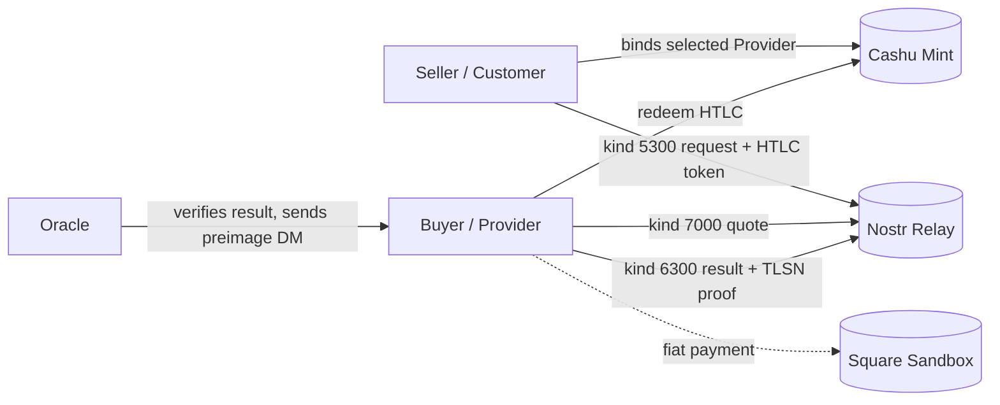

# TLSN Fiat Swap (Square)

> **Status: Testnet.** Square Sandbox + testnet/regtest Cashu only. Do not use
> mainnet sats or production Square credentials with this example.

> **Uses:** `anchr-sdk` Customer / Provider primitives, Nostr, Cashu HTLC, and
> an Oracle. No middleman/reference-host API is required.

## Role Mapping

The Seller has testnet BTC/ecash and wants fiat. In the SDK protocol that party
is the **Customer**: they request proof of a Square payment and lock Cashu
proofs into an HTLC.

The Buyer has fiat and wants BTC. In the SDK protocol that party is the
**Provider**: they pay via Square, produce the TLSNotary proof, and redeem the
HTLC after the Oracle verifies the proof and releases the preimage.

## How It Works



The SDK flow is direct Customer/Provider interaction over Nostr:

- Seller calls `createCustomer(...).request(...)`.
- Buyer calls `createProvider(...).serve(...)`.
- The Oracle exposes only its hash/preimage role, for example `POST /hash`.
- The SDK does not add swap-specific `/queries`, `/quotes`, `/select`, or
  `/begin` APIs.

**Trust model: no swap custodian, oracle-gated release:**

- The Seller can't take fiat without delivering BTC: the Oracle only reveals the
  preimage when it accepts a _valid_ Square receipt.
- The Buyer can't take BTC without paying fiat: no preimage means no redemption.
- The Oracle can't custody the BTC: it only holds the secret, not the locked
  tokens. A malicious or mistaken Oracle can still release the wrong secret;
  higher-stakes flows should use a t-of-n Oracle set and accept that threshold
  trust assumption explicitly.
- If the Oracle never responds, the Seller refunds via the locktime.

## Testnet Readiness

- `seller.ts` fails closed without `FIAT_SWAP_SOURCE_PROOFS_JSON`,
  `FIAT_SWAP_ORACLE_ENDPOINT`, and `FIAT_SWAP_ORACLE_PUBKEY`.
- `buyer.ts` fails closed without `FIAT_SWAP_PROVIDER_PRIVKEY`, and only quotes
  predicates matching the configured fiat terms.
- TLSNotary predicate is pinned to `connect.squareupsandbox.com` and checks
  `payment.status=COMPLETED`, exact amount, exact currency, and optionally
  `payment.location_id`.
- The Provider result carries the exact Square payment URL when
  `FIAT_SWAP_PAYMENT_ID` is set.

## Files

- `seller.ts` — Seller/Customer side: locks Cashu proofs, publishes the request,
  selects a Provider quote, and waits for the result.
- `buyer.ts` — Buyer/Provider side: listens for requests, quotes matching
  predicates, publishes the TLSN result, and redeems after Oracle preimage
  delivery.
- `fiat-swap.ts` — shared testnet config, Square predicate builder, proof
  helpers.
- `fiat-swap.test.ts` — release-safety tests for predicate pinning and config.
- `RUNBOOK.md` — operational guide.

## Run It

See [`RUNBOOK.md`](RUNBOOK.md).

The short version:

```bash
docker compose up -d

export NOSTR_RELAYS=ws://localhost:7777
export CASHU_MINT_URL=http://localhost:3338
export FIAT_SWAP_ORACLE_ENDPOINT=http://localhost:3001
export FIAT_SWAP_ORACLE_PUBKEY=<oracle-pubkey-hex>
export SQUARE_PAYMENT_LINK=https://square.link/u/...
export FIAT_SWAP_SOURCE_PROOFS_JSON='[...]'
deno task fiat-swap:seller
```

In another terminal:

```bash
export NOSTR_RELAYS=ws://localhost:7777
export CASHU_MINT_URL=http://localhost:3338
export FIAT_SWAP_ORACLE_PUBKEY=<oracle-pubkey-hex>
export FIAT_SWAP_PROVIDER_PRIVKEY=<buyer-provider-secret-key>
export FIAT_SWAP_PAYMENT_ID=<square-payment-id>
export FIAT_SWAP_PROOF_FILE=proof.presentation.tlsn
deno task fiat-swap:buyer
```

## Trust Model Recap

| Behaviour                                      | Outcome                                                                                                                                 |
| ---------------------------------------------- | --------------------------------------------------------------------------------------------------------------------------------------- |
| Buyer pays Square correctly + valid TLSN proof | Oracle reveals preimage; Buyer redeems BTC; Seller keeps fiat                                                                           |
| Buyer pays nothing and submits bogus proof     | Oracle rejects (invalid cert chain or response body); no preimage; Seller refunds via locktime                                          |
| Buyer pays but Oracle goes silent              | Locktime expires; Seller refunds the BTC. Buyer's fiat is at Square, not at the Seller — recovery is off-protocol (chargeback, dispute) |
| Seller takes fiat, never locks BTC             | No HTLC was ever opened; the Buyer should not have paid. This is an off-protocol failure, not a protocol failure                        |

The last row is the only off-protocol risk and is the same risk as any
non-escrowed Square transaction — this flow does not magically protect a Buyer
who paid before verifying that the Seller's HTLC actually exists. The order
matters: **Seller locks first, Buyer pays second**.
