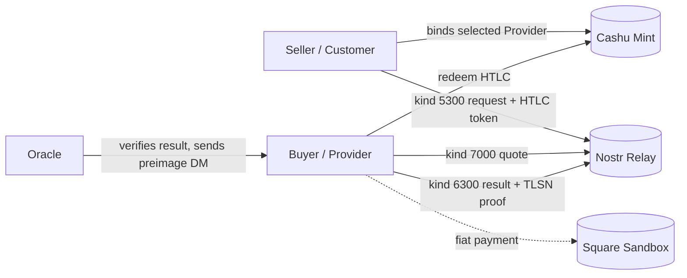

# 渡(Watari)

> _Watari_ — a crossing or ferry. Here: trustless fiat ↔ BTC crossing via Square
> Sandbox payment proof.

> **Status: Testnet.** Square Sandbox + testnet/regtest Cashu only. Do not use
> mainnet sats or production Square credentials with this example.

> **Uses:** `anchr-sdk` Customer / Provider primitives, Nostr, Cashu HTLC, and
> an Oracle. No middleman/reference-host API is required.

## Role Mapping

Watari's Seller has testnet BTC/ecash and wants fiat. In the SDK protocol that
party is the **Customer**: they request proof of a Square payment and lock Cashu
proofs into an HTLC.

Watari's Buyer has fiat and wants BTC. In the SDK protocol that party is the
**Provider**: they pay via Square, produce the TLSNotary proof, and redeem the
HTLC after the Oracle verifies the proof and releases the preimage.

## How It Works



The SDK flow is direct Customer/Provider interaction over Nostr:

- Seller calls `createCustomer(...).request(...)`.
- Buyer calls `createProvider(...).serve(...)`.
- The Oracle exposes only its hash/preimage role, for example `POST /hash`.
- The SDK does not add Watari-specific `/queries`, `/quotes`, `/select`, or
  `/begin` APIs.

## Testnet Readiness

- `seller.ts` fails closed without `WATARI_SOURCE_PROOFS_JSON`,
  `WATARI_ORACLE_ENDPOINT`, and `WATARI_ORACLE_PUBKEY`.
- `buyer.ts` fails closed without `WATARI_PROVIDER_PRIVKEY`, and only quotes
  Watari predicates matching the configured fiat terms.
- TLSNotary predicate is pinned to `connect.squareupsandbox.com` and checks
  `payment.status=COMPLETED`, exact amount, exact currency, and optionally
  `payment.location_id`.
- The Provider result carries the exact Square payment URL when
  `WATARI_PAYMENT_ID` is set.

## Files

- `seller.ts` — Seller/Customer side: locks Cashu proofs, publishes the request,
  selects a Provider quote, and waits for the result.
- `buyer.ts` — Buyer/Provider side: listens for requests, quotes matching Watari
  predicates, publishes the TLSN result, and redeems after Oracle preimage
  delivery.
- `watari.ts` — shared Testnet config, Square predicate builder, proof helpers.
- `watari.test.ts` — release-safety tests for predicate pinning and config.
- `RUNBOOK.md` — operational guide.

## Run It

See [`RUNBOOK.md`](RUNBOOK.md).

The short version:

```bash
docker compose up -d

export NOSTR_RELAYS=ws://localhost:7777
export CASHU_MINT_URL=http://localhost:3338
export WATARI_ORACLE_ENDPOINT=http://localhost:3001
export WATARI_ORACLE_PUBKEY=<oracle-pubkey-hex>
export SQUARE_PAYMENT_LINK=https://square.link/u/...
export WATARI_SOURCE_PROOFS_JSON='[...]'
deno task watari:seller
```

In another terminal:

```bash
export NOSTR_RELAYS=ws://localhost:7777
export CASHU_MINT_URL=http://localhost:3338
export WATARI_ORACLE_PUBKEY=<oracle-pubkey-hex>
export WATARI_PROVIDER_PRIVKEY=<buyer-provider-secret-key>
export WATARI_PAYMENT_ID=<square-payment-id>
export WATARI_PROOF_FILE=proof.presentation.tlsn
deno task watari:buyer
```
