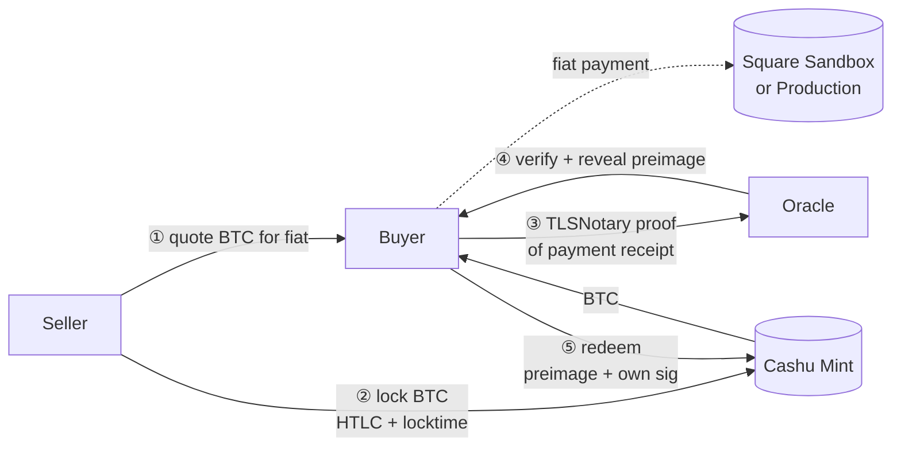

# 渡(Watari)

> *Watari* — a crossing or ferry. Here: trustless fiat ↔ BTC crossing
> via Square card payment proof.

> **Uses:** `anchr-sdk` → reference server (`@anchr/tlsn-toolkit` + `@anchr/cashu-conditional-swap`).
> **Pattern:** bounty (Seller asks for proof of fiat payment, Buyer provides it; see role mapping below for the inversion note).

**Fiat ↔ BTC swap.** A Buyer pays the Seller via Square; the receipt is
TLSNotary-proved to an Oracle, which releases the BTC the Seller has
pre-locked in a Cashu HTLC. Neither the Seller nor the Oracle ever
custodies the Buyer's fiat or controls the unlock unilaterally.

> **Anchr role mapping.** The Seller plays the **Requester** role
> (locks the BTC, requests proof of fiat payment) and the Buyer plays
> the **Worker** role (produces the TLSN proof). This may feel inverted
> because the Buyer "buys" BTC — but in Anchr's wire vocabulary the
> Requester is whoever asks the protocol for a verified outcome, and
> here that's the Seller asking for proof that they were paid.

## How it works

1. **Quote** — Seller advertises an exchange rate (off-protocol; could
   be Nostr, a website, OTC chat).
2. **Lock** — Seller locks BTC at the Cashu Mint with a hashlock whose
   preimage only the Oracle can release after verifying the Buyer's
   payment proof. The lock has a `locktime` refund so the Seller
   recovers BTC if the swap stalls.
3. **Pay** — Buyer pays the Seller via Square (sandbox for testing,
   production for real swaps).
4. **Prove + verify** — Buyer fetches the Square Payments API receipt
   over MPC-TLS via the local prover, producing a TLSNotary
   presentation. Anchr's Oracle validates the cert chain, the response
   body, and the payment metadata (amount, currency, recipient ID).
5. **Redeem** — Oracle reveals the preimage to the Buyer; the Buyer
   redeems the BTC at the Mint with `preimage + their own signature`.

**Why this is trustless:**

- The Seller can't take fiat without delivering BTC: the Oracle only
  reveals the preimage when a *valid* Square receipt is presented.
- The Buyer can't take BTC without paying fiat: no preimage means no
  redemption.
- The Oracle can't steal: it only holds the secret, not the BTC. If the
  Oracle releases the wrong preimage, the wrong party would still need
  their own signature, and there is none that lets the Oracle act
  unilaterally.
- If the Oracle never responds, the Seller refunds via the locktime.

## Why Square

Stripe uses RSA certificates, and MPC-TLS is impractically slow on RSA
signatures (multi-minute hangs in our tests). Square uses ECDSA (P-256)
certificates, and a full notarization completes in **~2 seconds**.

For Stripe and other RSA-cert merchants, see the parallel
`tlsn-fiat-swap-stripe` track — different proof strategy required.

## Run it

Operational walkthrough — Square sandbox setup, infra start-up, end-to-end
notarization commands — lives in [`RUNBOOK.md`](RUNBOOK.md).

## Files

- **buyer.ts** — Buyer side: pays via Square, generates TLSN proof,
  submits to Oracle, redeems Cashu HTLC.
- **seller.ts** — Seller side: posts quote, locks BTC at the Mint,
  refunds via locktime if the swap stalls.
- **RUNBOOK.md** — End-to-end operational guide (Japanese).

## Trust model recap

| Behaviour | Outcome |
|---|---|
| Buyer pays Square correctly + valid TLSN proof | Oracle reveals preimage; Buyer redeems BTC; Seller keeps fiat |
| Buyer pays nothing and submits bogus proof | Oracle rejects (invalid cert chain or response body); no preimage; Seller refunds via locktime |
| Buyer pays but Oracle goes silent | Locktime expires; Seller refunds the BTC. Buyer's fiat is at Square, not at the Seller — recovery is off-protocol (chargeback, dispute) |
| Seller takes fiat, never locks BTC | No HTLC was ever opened; the Buyer should not have paid. This is an off-protocol failure, not a Watari failure |

The last row is the only off-protocol risk and is the same risk as any
non-escrowed Square transaction — Watari does not magically protect a
Buyer who paid before verifying that the Seller's HTLC actually exists.
The order matters: **Seller locks first, Buyer pays second**.
